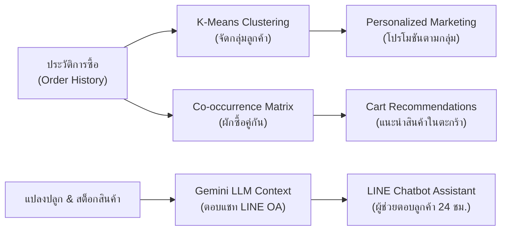

# 🌱 FarmGAP — ระบบบริหารจัดการฟาร์มผักมาตรฐาน GAP และสั่งซื้อผ่าน LINE OA & AI

FarmGAP เป็นแพลตฟอร์มบริหารจัดการสวนผักแบบครบวงจร (Digital GAP Compliance Platform) สำหรับเกษตรกรยุคใหม่ที่ปลูกผักบนแคร่ในโรงเรือนหลังคาพลาสติกใส รองรับทั้งการบันทึกข้อมูลแปลงปลูกตามมาตรฐาน **มกษ. 9001**, ระบบควบคุมการให้น้ำสะอาดอัจฉริยะ (Smart Auto-Watering & Per-plot Pause), การติดตามความเสี่ยงสารเคมีตกค้าง (PHI Control), ระบบเก็บเกี่ยวผลผลิตและเชื่อมโยงเข้าคลังสินค้าอัตโนมัติ (Harvest-to-Stock Integration), ระบบจัดการคำสั่งซื้อผ่าน **LINE Official Account (LIFF)** พร้อมพิมพ์ใบปะหน้าพัสดุ ตลอดจนระบบ **AI วิเคราะห์จัดกลุ่มลูกค้า (K-Means Clustering)** และ **AI แนะนำสินค้าอัจฉริยะ (Product Recommendation & Google Gemini LLM)**

---

## 📑 สารบัญ
1. [เทคโนโลยีที่เลือกใช้และหน้าที่ (Tech Stack)](#-เทคโนโลยีที่เลือกใช้และหน้าที่-tech-stack)
2. [ภาพรวมโมดูลและฟังก์ชันการทำงานล่าสุด (Latest System Modules)](#-ภาพรวมโมดูลและฟังก์ชันการทำงานล่าสุด-latest-system-modules)
3. [ระบบ AI และอัลกอริทึมที่ใช้งาน (AI & Analytics Engine)](#-ระบบ-ai-และอัลกอริทึมที่ใช้งาน-ai--analytics-engine)
4. [โครงสร้างบทบาทและสิทธิ์ผู้ใช้งาน (Role-Based Access Control)](#-โครงสร้างบทบาทและสิทธิ์ผู้ใช้งาน-role-based-access-control)
5. [โครงสร้างโฟลเดอร์ของโปรเจกต์ (Project Architecture)](#-โครงสร้างโฟลเดอร์ของโปรเจกต์-project-architecture)
   - [สถาปัตยกรรมโมดูลบริการ LINE OA & AI Engine (`services/line`)](#-สถาปัตยกรรมโมดูลบริการ-line-oa--ai-engine-backendserviceline)
6. [ขั้นตอนการเตรียมตัวก่อน Deploy ขึ้น Production](#-ขั้นตอนการเตรียมตัวก่อน-deploy-ขึ้น-production)
7. [การตั้งค่าบน LINE Developers Console & LINE Official Account](#-การตั้งค่าบน-line-developers-console--line-official-account)
8. [จุดที่ต้องเปลี่ยน URL / Configurations (Local ➡️ Production)](#-จุดที่ต้องเปลี่ยน-url--configurations-local-️-production)
9. [การรันโปรเจกต์ในเครื่อง (Local Development)](#-การรันโปรเจกต์ในเครื่อง-local-development)
10. [มาตรฐานความปลอดภัยและการรับรอง GAP (GAP Compliance Criteria)](#-มาตรฐานความปลอดภัยและการรับรอง-gap-gap-compliance-criteria)

---

## 💻 เทคโนโลยีที่เลือกใช้และหน้าที่ (Tech Stack)

### 🎨 ฝั่ง Frontend (Web Application & LIFF)
| เทคโนโลยี | หน้าที่และการทำงาน |
| :--- | :--- |
| **React 19** | โครงสร้างหลักในการพัฒนา Single Page Application (SPA) จัดการ State และ Component-based UI |
| **Vite** | Build Tool สมัยใหม่ที่รวดเร็ว ช่วย Hot Module Replacement (HMR) และ Optimize Chunks ตอนขึ้น Production |
| **TailwindCSS (v4)** | Utility-first CSS Framework สำหรับสร้าง Responsive & Modern UI รองรับหน้าจอคอม พีซี แท็บเล็ต และสมาร์ตโฟน |
| **Recharts** | ไลบรารีเรนเดอร์กราฟแสดงผลสถิติผลผลิตรายเดือนและแนวโน้มรายได้ (Bar Chart / Area Chart) |
| **Lucide React** | ชุดไอคอน UI ที่คมชัดและสื่อความหมายชัดเจน |
| **@line/liff** | LINE Front-end Framework SDK สำหรับดึง Profile ลูกค้า (`userId`, `displayName`, `pictureUrl`) อัตโนมัติเมื่อเปิดผ่าน LINE |
| **Axios** | ทำหน้าที่ยิง HTTP Requests เชื่อมต่อ RESTful API ของ Backend พร้อมแนบ JWT Token อัตโนมัติ |
| **date-fns** | จัดการและแปลงรูปแบบวันที่สำหรับการคำนวณวันปลอดภัยเก็บเกี่ยว (PHI) และรายงานรอบเวลา |
| **Sonner** | ไลบรารี Toast Notification แจ้งเตือนสถานะการบันทึกข้อมูลอย่างสวยงาม |

---

### ⚙️ ฝั่ง Backend (RESTful API & Webhook)
| เทคโนโลยี | หน้าที่และการทำงาน |
| :--- | :--- |
| **Node.js & Express.js** | รัน Server ให้บริการ RESTful API สำหรับการจัดการข้อมูล GAP, แปลงปลูก, สินค้า, ออเดอร์ และ AI Endpoints |
| **MySQL2 (Connection Pool)** | เชื่อมต่อฐานข้อมูลเชิงสัมพันธ์ (Relational Database) รองรับ Query ที่ซับซ้อนและการทำงานแบบ Transaction |
| **JSON Web Token (JWT)** | จัดการระบบ Authentication / Authorization ยืนยันตัวตนเจ้าของฟาร์มและคนงานอย่างปลอดภัย |
| **@line/bot-sdk** | SDK สำหรับส่งข้อความโต้ตอบอัตโนมัติ (Reply Message) และแจ้งเตือนสถานะคำสั่งซื้อ (Push Notification) ด้วย Flex Message |
| **Crypto (Node.js Built-in)** | คำนวณ HMAC SHA-256 สำหรับตรวจสอบ **LINE Webhook Signature** ป้องกันการโจมตีหรือปลอมแปลง Request |
| **Google Gemini API** | โมเดลภาษาขนาดใหญ่ (LLM) ทำหน้าที่เป็น AI Assistant ตอบคำถามลูกค้าใน LINE OA อิงตามบริบทสต็อกผักสดในฟาร์มจริง |
| **Multer** | จัดการการอัปโหลดไฟล์ภาพถ่าย เช่น สลิปการชำระเงิน, ภาพถ่ายแปลงปลูก และภาพถ่ายผลผลิต |

---

## 🌟 ภาพรวมโมดูลและฟังก์ชันการทำงานล่าสุด (Latest System Modules)

ระบบ FarmGAP ได้รับการอัปเกรดให้รองรับการทำงานในฟาร์มจริงอย่างละเอียด ดังนี้:

### 1. 🌿 ระบบจัดการแปลงและรอบการปลูก (Plots & Crop Cycles)
- **การ์ดแปลงปลูกและแคร่ปลูก:** แสดงสถานะแปลงแบบเรียลไทม์ (แปลงว่างพร้อมเริ่มรอบใหม่, กำลังปลูก, พร้อมเก็บเกี่ยว)
- **ระบบรหัสรอบปลูกอัตโนมัติ (Crop Cycle / Batch ID):** สร้างรหัสรอบปลูกอัตโนมัติในรูปแบบ `BATCH-YYYYMM-XX/แคร่ที่Y-RZ` เพื่อใช้อ้างอิงตลอดกระบวนการ
- **บันทึกสูตรดินและไดอารี่การดูแล (Soil Recipe & Care Diary):** บันทึกสูตรผสมดินแปลง และบันทึกพัฒนาการของผักรายสัปดาห์
- **การแก้ไขและยกเลิกรอบปลูก (Edit / Cancel Batch):** รองรับการปรับเปลี่ยนข้อมูลรอบปลูก หรือยกเลิกรอบปลูกกรณีเกิดภัยธรรมชาติหรือแมลงระบาด พร้อมคืนสถานะแปลงเป็นแปลงว่าง

### 2. 💧 ระบบควบคุมการให้น้ำสะอาด GAP (Smart Clean Water Management)
- **โหมดรดน้ำอัตโนมัติ (Smart Auto GAP Routine):** ตั้งเวลาเช้า/เย็น, ปริมาณน้ำต่อต้น และกำหนดช่วงวันทำงานอัตโนมัติ
- **ระบบสลับโหมดเว้นน้ำรายแปลง (Per-Plot Water Pause):** มีปุ่ม `● รดน้ำออโต้` และ `● เว้นน้ำ` ที่การ์ดแปลงทุกใบ เกษตรกรสามารถสั่ง "เว้นน้ำ" เฉพาะแปลงที่ต้องการ (เช่น แปลงที่ใกล้ตัดเก็บเกี่ยว เพื่อลดความชื้น) โดยระบบออโต้จะไม่บันทึกรดน้ำให้แปลงดังกล่าว
- **ปรับบันทึกตามสภาพอากาศ (Climate Humidity Toggle):** สลับสภาพอากาศระหว่าง `ฝนตก/ความชื้นสูง` (บันทึกเป็นการรดควบคุมความชื้นโรงเรือน GAP) และ `แดดจัดปกติ`
- **ตารางประวัติการให้น้ำ 1 วัน 1 แถว รวมทุกแปลง (Daily Master Audit Table):** บันทึกข้อมูลแบบรวมรอบ เช้า/เย็น ในแถวเดียวของแต่ละวัน ไม่เปลืองพื้นที่ฐานข้อมูล พร้อมปุ่มดูรายละเอียดย่อย (Modal Breakdown) สำหรับยื่นตรวจรับรอง มกษ. 9001

### 3. 🧪 ระบบบันทึกปุ๋ย สารเคมี และควบคุมระยะปลอดภัย (Chemicals & PHI Control)
- **การคำนวณระยะปลอดภัยก่อนเก็บเกี่ยว (Pre-Harvest Interval - PHI):** ระบบคำนวณวันปลอดภัยอัตโนมัติจากวันที่พ่นสาร + จำนวนวัน PHI
- **ระบบล็อกการเก็บเกี่ยว (Harvest Lock):** ป้องกันไม่ให้เกษตรกรกดตัดผลผลิตหากยังไม่พ้นกำหนดวันปลอดภัย PHI เพื่อป้องกันสารตกค้าง 100%
- **บันทึกอุปกรณ์ป้องกันตนเอง (Safety PPE):** บันทึกการสวมใส่อุปกรณ์นิรภัยของผู้ฉีดพ่นตามเกณฑ์มาตรฐานความปลอดภัยแรงงาน

### 4. 🐛 ระบบบันทึกการสำรวจและจัดการศัตรูพืช (Pest & Disease Control)
- บันทึกการตรวจพบโรคและแมลงศัตรูพืช ระดับความรุนแรง
- บันทึกแนวทางการบำบัดรักษาโดยเน้นชีววิธี (Biological Control) และวิธีกลเพื่อลดการใช้สารเคมี

### 5. 🧺 ระบบเก็บเกี่ยวผลผลิตและนำเข้าสต็อกอัตโนมัติ (Harvest-to-Stock Integration)
- **1-Click Harvest to Inventory:** เมื่อบันทึกการเก็บเกี่ยวผลผลิต สามารถเลือก "นำเข้าสต็อกสินค้าทันที" ระบุจำนวนแพ็ค/กก. และราคาขายต่อหน่วย
- **Auto Sync Products:** ระบบจะสร้างหรืออัปเดตสต็อกในตาราง `products` ให้อัตโนมัติทันที พร้อมเปิดขายบนหน้าร้าน LINE
- **Traceability Lot Generation:** ระบบออกรหัสรุ่นผลผลิต (Lot Number) ประจำรอบการเก็บเกี่ยวเพื่อใช้สืบย้อนกลับ

### 6. 🛒 ระบบพาณิชย์อิเล็กทรอนิกส์ผ่าน LINE OA (LINE E-Commerce & LIFF)
- **หน้าร้านสั่งซื้อผักสด (LIFF Order):** ลูกค้าเข้าสั่งซื้อผักสดผ่าน LINE ได้โดยตรง โดยระบบดึง Profile อัตโนมัติไม่ต้องสมัครสมาชิก
- **แนบสลิปและตรวจสอบชำระเงิน:** ลูกค้าอัปโหลดสลิปโอนเงินผ่านระบบ และเจ้าของฟาร์มสามารถตรวจสอบสลิปในหน้าจัดการออเดอร์
- **ระบบติดตามสถานะคำสั่งซื้อ (LIFF History):** ลูกค้าตรวจสอบสถานะออเดอร์ (รอตรวจสอบ, เตรียมจัดส่ง, จัดส่งแล้ว) ได้ตลอด 24 ชม.
- **พิมพ์ใบปะหน้าพัสดุ (Shipping Label):** เจ้าของฟาร์มพิมพ์ใบปะหน้ากล่องพัสดุพร้อมรหัสคำสั่งซื้อและที่อยู่จัดส่งได้ในคลิกเดียว

### 7. 🔍 ระบบตรวจสอบย้อนกลับผลผลิต (Traceability via QR Code)
- ลูกค้าหรือผู้บริโภคสามารถสแกน QR Code บนแพ็คเกจผัก เพื่อเข้าสู่หน้า `/trace/:lot`
- แสดงข้อมูลโปร่งใส 100%: ชนิดผัก, แปลง/แคร่ปลูก, วันที่ปลูก, วันที่เก็บเกี่ยว, แหล่งน้ำสะอาดที่ใช้, สารชีวภาพที่ใช้ และใบรับรอง GAP

---

## 🧠 ระบบ AI และอัลกอริทึมที่ใช้งาน (AI & Analytics Engine)

ระบบ FarmGAP มีการนำเทคโนโลยี AI และ Data Science เข้ามาช่วยเพิ่มมูลค่าฟาร์ม 3 รูปแบบหลัก:



### 1. 🎯 K-Means Clustering (การแบ่งกลุ่มพฤติกรรมลูกค้า)
- **วัตถุประสงค์:** วิเคราะห์พฤติกรรมการซื้อ เพื่อจัดกลุ่มลูกค้าอัตโนมัติ ช่วยให้เกษตรกรทำการตลาดและแจ้งเตือนผักสดได้ตรงกลุ่มเป้าหมาย
- **ฟีเจอร์เวกเตอร์ที่นำมาคำนวณ (4 Dimensions):**
  1. `order_count`: จำนวนครั้งที่ลูกค้าสั่งซื้อ
  2. `total_spend`: ยอดเงินรวมที่เคยชำระทั้งหมด (บาท)
  3. `avg_order_value`: มูลค่ายอดซื้อเฉลี่ยต่อบิล (บาท)
  4. `total_items`: จำนวนชิ้นผักสดรวมที่เคยสั่ง
- **ขั้นตอนการทำงานของอัลกอริทึม (Mathematical Workflow):**
  1. **Feature Scaling (Min-Max Normalization):**
     $$X_{\text{norm}} = \frac{X - X_{\min}}{X_{\max} - X_{\min}}$$
  2. **Centroid Initialization ($K=3$):**
     - **กลุ่มที่ 1:** สลัดเลิฟเวอร์ (Salad Lovers) — สั่งบ่อย ยอดปานกลาง
     - **กลุ่มที่ 2:** ลูกค้าขาประจำ (Regular Customers) — สั่งหลากหลาย สม่ำเสมอ
     - **กลุ่มที่ 3:** ลูกค้าขายส่ง / B2B (Bulk Buyers) — ยอดชำระสูง สั่งคราวละมากๆ
  3. **Assignment Step (Euclidean Distance):**
     $$d(p, q) = \sqrt{\sum_{i=1}^{n} (p_i - q_i)^2}$$
  4. **Update Step:** คำนวณจุดศูนย์กลางกลุ่มใหม่จากค่าเฉลี่ยของสมาชิกในกลุ่ม
  5. **Convergence:** ทำซ้ำจนตำแหน่ง Centroid ไม่เปลี่ยนแปลง และบันทึกลงคอลัมน์ `customers.cluster_id`

### 2. 🥦 Market Basket Analysis & Collaborative Recommendation (ระบบแนะนำผักซื้อคู่กัน)
- **วัตถุประสงค์:** เพิ่มยอดขายต่อบิล (Cross-selling) ในหน้า LIFF Cart เมื่อลูกค้าเลือกผักชนิดหนึ่ง ระบบจะแนะนำผักหรือสินค้าที่มักถูกสั่งซื้อร่วมกัน
- **หลักการทำงาน:** ใช้ SQL Self-Join วิเคราะห์ **Co-occurrence Matrix** ระหว่างสินค้าในตาราง `order_items`:
  $$\text{Recommendation Score} = \frac{\text{จำนวนออเดอร์ที่มีสินค้า A และ B พร้อมกัน}}{\text{จำนวนออเดอร์ทั้งหมดที่มีสินค้า A}}$$

### 3. 🤖 Google Gemini AI (ผู้ช่วยเกษตรกรตอบแชท LINE OA อัจฉริยะ)
- **วัตถุประสงค์:** ตอบคำถามลูกค้าเกี่ยวกับวิธีการปลูก ความปลอดภัยตามมาตรฐาน GAP และสต็อกสินค้าล่าสุด
- **หลักการทำงาน (Dynamic Context / Prompt Injection):**
  - ดึงข้อมูลสต็อกสินค้าจริงที่พร้อมขาย (`status = 'available'`) และแปลงปลูกปัจจุบันมาประกอบเป็น System Context
  - ส่งต่อไปยังโมเดล `gemini-1.5-flash` / `gemini-2.0`
  - ทำให้ AI สามารถตอบคำถามเกี่ยวกับสต็อกสินค้าจริงของฟาร์มในขณะนั้นได้อย่างแม่นยำ ไม่เกิดปัญหา Hallucination

---

## 👥 โครงสร้างบทบาทและสิทธิ์ผู้ใช้งาน (Role-Based Access Control)

ระบบมีการจำแนกสิทธิ์ผู้ใช้งานผ่าน `App.jsx` และ Backend Middleware:

| บทบาท (Role) | สิทธิ์การเข้าถึงและการทำงานในระบบ |
| :--- | :--- |
| **เจ้าของฟาร์ม (`owner`)** | เข้าถึงได้ทุกหน้าในระบบ: จัดการแปลง, จัดการรอบปลูก, บันทึกปัจจัยการผลิต, จัดการสต็อก, อนุมัติออเดอร์, ดูรายงานการเงิน-ต้นทุน, ออกรายงาน GAP และสั่งรันประมวลผล AI |
| **คนงานในฟาร์ม (`worker`)** | เข้าถึงหน้าบันทึกการปฏิบัติงานแปลง: บันทึกการให้น้ำ (กดรดด่วน/เว้นน้ำ), บันทึกการใช้ปุ๋ย/สารชีวภัณฑ์, บันทึกการสำรวจโรคแมลง และบันทึกการตัดเก็บเกี่ยว |
| **ลูกค้าทั่วไป (`user` / ลูกค้า LINE)** | เมื่อล็อกอินหรือเข้าผ่าน LINE จะถูก Redirect ไปที่หน้าร้านสั่งซื้อผักสด (`/liff/order`) และหน้าประวัติคำสั่งซื้อ (`/liff/history`) เท่านั้น ไม่สามารถเข้าถึงหน้าจัดการหลังบ้านได้ |

---

## 📂 โครงสร้างโฟลเดอร์ของโปรเจกต์ (Project Architecture)

```text
farmgap/
├── backend/
│   ├── db/
│   │   └── schema.sql              # โครงสร้างฐานข้อมูล MySQL ล่าสุด
│   ├── src/
│   │   ├── index.js                # จุดเริ่มต้น Express Server & Webhook Routing
│   │   ├── db.js                   # MySQL2 Connection Pool
│   │   ├── seed.js                 # สคริปต์ Mock ข้อมูลตั้งต้นของระบบ
│   │   ├── middleware/
│   │   │   └── auth.js             # Middleware ตรวจสอบสิทธิ์ JWT Token
│   │   └── routes/
│   │       ├── auth.js             # ยืนยันตัวตน Login / Register
│   │       ├── plots.js            # จัดการแปลงปลูก และปุ่มสลับรดน้ำออโต้รายแปลง (plot-auto-toggle)
│   │       ├── batches.js          # จัดการรอบการปลูก (Start / Edit / Cancel Crop Batches)
│   │       ├── crops.js            # คลังข้อมูลพืชและชนิดผักมาตรฐาน
│   │       ├── diary.js            # ไดอารี่การดูแลแปลงและพัฒนาการพืช
│   │       ├── water.js            # ระบบน้ำอัจฉริยะ, ตาราง 1 วัน 1 แถว, ตั้งเวลากิจวัตร, ปรับสภาพอากาศ
│   │       ├── chemicals.js        # บันทึกปุ๋ย/สารเคมี คำนวณวันปลอดภัย PHI
│   │       ├── pests.js            # บันทึกการสำรวจและจัดการศัตรูพืช
│   │       ├── harvest.js          # บันทึกการเก็บเกี่ยวผลผลิต และ Auto-stock สินค้า
│   │       ├── products.js         # จัดการสินค้าหน้าร้านและสต็อกพร้อมขาย
│   │       ├── orders.js           # จัดการคำสั่งซื้อ แนบสลิป ตรวจสอบชำระเงิน
│   │       ├── sales.js            # รายงานสรุปยอดขายและการเงิน
│   │       ├── customers.js        # ซิงก์และจัดเก็บข้อมูลลูกค้า LINE
│   │       ├── report.js           # สร้างข้อมูลรายงานส่งตรวจประเมิน GAP (มกษ. 9001)
│   │       ├── trace.js            # ระบบสืบย้อนกลับผลผลิต (Traceability) ผ่านรหัส Lot
│   │       ├── upload.js           # บริการอัปโหลดไฟล์ภาพผ่าน Multer
│   │       ├── line.js             # LINE Webhook Controller (Modular Entry Point ขนาดกะทัดรัด)
│   │       └── ai.js               # K-Means Clustering & Product Recommendation Engine
│   │   └── services/
│   │       └── line/               # สถาปัตยกรรมบริการ LINE OA & AI Engine (ดูโครงสร้างละเอียดด้านล่าง)
│   ├── package.json
│   └── .env.example
├── frontend/
│   ├── src/
│   │   ├── main.jsx
│   │   ├── App.jsx                 # Routing และ Role Guards Guarding
│   │   ├── index.css               # สไตล์ TailwindCSS และ Glassmorphism Theme
│   │   ├── components/
│   │   │   ├── Layout.jsx          # โครงสร้างเมนูหลักและ Responsive Sidebar Navigation
│   │   │   └── LogManager.jsx      # Generic Table Component สำหรับบันทึกข้อมูลมาตรฐาน GAP
│   │   ├── lib/
│   │   │   ├── api.js              # Axios Instance พร้อม Interceptors
│   │   │   ├── auth.jsx            # React Auth Context Provider
│   │   │   ├── config.js           # จัดการ Dynamic API URL Configuration
│   │   │   └── cropCycle.js        # Utility สร้างและแปลงรหัสรอบปลูก
│   │   └── pages/
│   │       ├── Dashboard.jsx       # แดชบอร์ดสรุปสถิติ 6 มิติ, กราฟผลผลิต-รายได้, การ์ดแคร่แปลง, AI จัดกลุ่มลูกค้า
│   │       ├── Plots.jsx           # ข้อมูลแคร่แปลงปลูก, สถานะรอบปลูก, ปุ่มเว้นน้ำรายแปลง
│   │       ├── Crops.jsx           # คลังชนิดผักและเกณฑ์การเก็บเกี่ยว
│   │       ├── CropDiary.jsx       # ไดอารี่บันทึกพัฒนาการและสูตรดิน
│   │       ├── Water.jsx           # บันทึกการให้น้ำสะอาด GAP, โหมดออโต้, ตารางสรุป 1 วัน 1 แถว
│   │       ├── Chemicals.jsx       # บันทึกการใช้ปุ๋ย/สารเคมี และระยะปลอดภัย PHI
│   │       ├── Pests.jsx           # บันทึกการสำรวจและจัดการโรคแมลงศัตรูพืช
│   │       ├── Harvest.jsx         # บันทึกการเก็บเกี่ยวผลผลิต และนำเข้าสต็อกทันที
│   │       ├── Products.jsx        # หน้ารายการสินค้าและสต็อกพร้อมขาย
│   │       ├── Storage.jsx         # จัดการคลังอุปกรณ์และปัจจัยการผลิต
│   │       ├── Costs.jsx           # บันทึกบัญชีต้นทุนการเกษตร
│   │       ├── Orders.jsx          # จัดการคำสั่งซื้อ ตรวจสลิป อัปเดตสถานะจัดส่ง
│   │       ├── SalesReport.jsx     # รายงานสรุปยอดขายแยกตามช่วงเวลา
│   │       ├── ShippingLabel.jsx   # หน้าพิมพ์ใบปะหน้ากล่องพัสดุ
│   │       ├── Report.jsx          # ส่งออกและพิมพ์แบบบันทึกมาตรฐาน GAP ขนาด A4
│   │       ├── Trace.jsx           # หน้าตรวจสอบย้อนกลับผลผลิตสำหรับผู้บริโภค
│   │       ├── LiffOrder.jsx       # หน้าร้านสั่งซื้อผักสดผ่าน LINE LIFF (ลูกค้า)
│   │       ├── LiffHistory.jsx     # หน้าติดตามสถานะออเดอร์ผ่าน LINE LIFF (ลูกค้า)
│   │       ├── Profile.jsx         # ข้อมูลโปรไฟล์ฟาร์มและข้อมูลเกษตรกร
│   │       └── Login.jsx           # หน้าเข้าสู่ระบบสำหรับเจ้าของฟาร์มและคนงาน
│   ├── package.json
│   └── .env.example
├── use_case_diagram.drawio         # ผัง Use Case Diagram ฉบับสมบูรณ์สำหรับเปิดใน draw.io
├── use_case_specification.md       # เอกสารวิเคราะห์ข้อกำหนด Use Case แบบละเอียดทุกโมดูล
└── README.md                       # เอกสารสรุปภาพรวมและคู่มือระบบฉบับล่าสุด
```

### 🤖 สถาปัตยกรรมโมดูลบริการ LINE OA & AI Engine (`backend/src/services/line/`)

ระบบ LINE Chatbot และ Webhook ได้รับการจัดโครงสร้างตามหลัก **Modular Clean Architecture** (แยกจาก `routes/line.js` เดิมที่มีขนาดกว่า 5,355 บรรทัด ให้กลายเป็น Controller ขนาดกะทัดรัดเพียง 26 บรรทัด และจัดกลุ่มไฟล์ย่อยตามหน้าที่อย่างเป็นระเบียบเพื่อง่ายต่อการบำรุงรักษาและต่อยอด):

```text
backend/src/services/line/
├── config.js                        # จัดการ LINE MessagingApiClient, Retry Wrapper, ตาราง Session ใน DB
├── orderService.js                  # จัดการออเดอร์ในแชท: สร้างออเดอร์, เช็คและตัดสต็อก, คืนสต็อก/ยกเลิกออเดอร์
├── eventHandler.js                  # จุดศูนย์กลางคัดแยกเหตุการณ์ (Event Router) และ State Machine ของแชท
│
├── ai/                              # บริการด้าน AI และบริบทฟาร์ม (AI & LLM Services)
│   ├── farmContext.js               # ดึงข้อมูลแปลง GAP, แผนเก็บเกี่ยว และสต็อกผักสด มาสร้างเป็น Dynamic System Instruction
│   └── gemini.js                    # ถาม-ตอบ Google Gemini (Multi-model Fallback: 2.0-flash / 1.5-flash) และ AI ตรวจจับเจตนายกเลิก
│
├── parsers/                         # ตัวประมวลผลข้อความและสกัดข้อมูลอัจฉริยะ (NLP & Smart Extraction)
│   ├── orderIntent.js               # สกัดรายการสั่งซื้อ, แปลง กิโล/ขีด -> ถุง อัตโนมัติ (Fast-path < 2ms)
│   └── addressParser.js             # สกัดชื่อ เบอร์โทร ที่อยู่ ด้วย Hybrid NLP (Regex ตรวจสอบรหัส ปณ. + Gemini AI Fallback)
│
├── flex/                            # แม่แบบข้อความ Flex Message UI Cards สำหรับห้องแชท LINE
│   ├── vegMenuCard.js               # การ์ดแสดงเมนูผักสดพร้อมส่ง พร้อมราคาและคำแนะนำการสั่ง
│   ├── webStoreCard.js              # การ์ดส่งลิงก์หน้าร้านสั่งซื้อบนเว็บไซต์ (LIFF Store)
│   ├── orderDraftCard.js            # การ์ดสรุปรายการสั่งซื้อ (ลูกค้าใหม่) และการ์ดยืนยันใช้ที่อยู่เดิม (ลูกค้าเก่า)
│   ├── missingContactCard.js        # การ์ดแจ้งเตือนข้อมูลจัดส่งที่ยังขาด (ที่อยู่, เบอร์โทร, ชื่อผู้รับ)
│   ├── invoiceCard.js               # ใบแจ้งหนี้พร้อม PromptPay QR Code ล็อกยอดเงินเป๊ะ และการ์ดยืนยันการรับสลิปเงินโอน
│   ├── paymentSelectionCard.js      # การ์ดเลือกช่องทางชำระเงิน (โอนเงินผ่านบัญชี/QR Code หรือ เก็บเงินปลายทาง COD)
│   ├── codCard.js                   # การ์ดยืนยันคำสั่งซื้อแบบเก็บเงินปลายทาง (COD)
│   ├── orderStatusCard.js           # การ์ดแสดงสถานะคำสั่งซื้อล่าสุด (Tracking) และการ์ดประวัติการสั่งซื้อย้อนหลัง
│   ├── welcomeCard.js               # การ์ดต้อนรับเมื่อลูกค้ากดเพิ่มเพื่อน หรือพิมพ์ทักทาย (สวัสดี, เริ่มต้น)
│   └── refundCard.js                # การ์ดแนะนำขั้นตอนการขอรับเงินคืน (Refund) และปุ่มโทรออกหาเจ้าของฟาร์มโดยตรง
│
└── notifications/                   # บริการส่งข้อความแจ้งเตือนอัตโนมัติ (LINE Push Notifications)
    ├── adminNotifier.js             # ส่ง Flex Message แจ้งเตือนเจ้าของฟาร์มทันทีเมื่อมีออเดอร์ใหม่ หรือลูกค้าแนบสลิปชำระเงิน
    └── customerNotifier.js          # ส่ง Flex Message แจ้งเตือนลูกค้าเมื่อสถานะออเดอร์เปลี่ยน (ชำระเงินแล้ว, กำลังจัดส่ง, จัดส่งสำเร็จ)
```

---

## 🚀 ขั้นตอนการเตรียมตัวก่อน Deploy ขึ้น Production

1. **Domain Name & HTTPS/SSL:**
   - LINE Webhook และ LINE LIFF **บังคับ** ให้ใช้ HTTPS เท่านั้น (เช่น `https://api.yourfarm.com` และ `https://app.yourfarm.com`)
2. **ฐานข้อมูล MySQL Production:**
   - ติดตั้ง MySQL หรือใช้ Managed Database (เช่น Railway, Aiven, AWS RDS)
   - นำไฟล์ `backend/db/schema.sql` ไป Execute เพื่อสร้างโครงสร้างตาราง
3. **LINE Official Account & Developers Console:**
   - สมัครบัญชี LINE OA ผ่าน [LINE Official Account Manager](https://manager.line.biz/)
   - สร้าง Provider และ Channels ใน [LINE Developers Console](https://developers.line.biz/)

---

## 📲 การตั้งค่าบน LINE Developers Console & LINE Official Account

### 1. Messaging API Channel (สำหรับ Chatbot & Push Notification)
1. เข้าไปที่ Messaging API Channel ใน LINE Developers Console
2. ไปที่แท็บ **Messaging API**:
   - **Webhook URL:** กรอก `https://<YOUR_BACKEND_DOMAIN>/api/line/webhook`
   - กดปุ่ม **Verify** (ต้องส่ง HTTP Status 200 กลับมา)
   - ติ๊กเปิด **Use webhook**
   - ติ๊กเปิด **Auto-reply messages** ใน LINE Official Account Manager ให้เป็น **Off** (เพื่อให้ Webhook ตอบแทน)
3. ออกรหัส:
   - **Channel access token (long-lived):** กด Issue แล้วคัดลอกมาใส่ใน `LINE_CHANNEL_ACCESS_TOKEN`
4. ไปที่แท็บ **Basic settings**:
   - **Channel secret:** คัดลอกมาใส่ใน `LINE_CHANNEL_SECRET`

### 2. LINE Login Channel & LIFF App (สำหรับหน้าร้านผักสดและติดตามออเดอร์)
1. สร้าง Channel ประเภท **LINE Login** ใน Provider เดียวกัน
2. ไปที่แท็บ **LIFF** แล้วกด **Add**:
   - **LIFF App ที่ 1 (สำหรับสั่งซื้อผักสด):**
     - **Size:** `Full` หรือ `Tall`
     - **Endpoint URL:** `https://<YOUR_FRONTEND_DOMAIN>/liff/order`
     - **Scope:** `profile`, `openid`
     - นำ **LIFF ID** ที่ได้ไปใส่ใน `VITE_LIFF_ID` ของ Frontend
   - **LIFF App ที่ 2 (สำหรับติดตามออเดอร์ลูกค้า):**
     - **Size:** `Full`
     - **Endpoint URL:** `https://<YOUR_FRONTEND_DOMAIN>/liff/history`
     - **Scope:** `profile`, `openid`

### 3. การสร้าง Rich Menu บน LINE Official Account
- **ปุ่มที่ 1 ("สั่งซื้อผักสด"):** ผูก Link (URL) ➡️ `https://liff.line.me/<YOUR_LIFF_ORDER_ID>`
- **ปุ่มที่ 2 ("ติดตามออเดอร์"):** ผูก Link (URL) ➡️ `https://liff.line.me/<YOUR_LIFF_HISTORY_ID>`
- **ปุ่มที่ 3 ("สอบถามสต็อก / คุยกับ AI"):** ผูก Text ➡️ ส่งข้อความคุยกับ Gemini Bot ได้ทันที

---

## 🔧 จุดที่ต้องเปลี่ยน URL / Configurations (Local ➡️ Production)

### 📁 ฝั่ง Backend (`backend/.env`)
| ตัวแปรใน `.env` | ตัวอย่างค่า Local | ตัวอย่างค่า Production | รายละเอียด |
| :--- | :--- | :--- | :--- |
| `PORT` | `4000` | `4000` หรือตามที่โฮสต์กำหนด | พอร์ตที่ Express รัน |
| `DB_HOST` | `localhost` | `db.yourfarm.com` | IP หรือ Host ของ MySQL Server |
| `DB_PORT` | `3306` | `3306` | พอร์ตของ MySQL Database |
| `DB_USER` | `root` | `farmgap_prod_user` | ชื่อ User ฐานข้อมูล |
| `DB_PASSWORD` | *(ว่าง)* | `StrongPassword#2026` | รหัสผ่านฐานข้อมูล |
| `DB_NAME` | `farmgap` | `farmgap` | ชื่อ Database |
| `JWT_SECRET` | `change-me-to-a-long-random-string` | *(สตริงสุ่มความยาว 64+ ตัวอักษร)* | คีย์เข้ารหัส JWT Token |
| `LINE_CHANNEL_ACCESS_TOKEN` | `dummy_token` | `eyJhbGciOi...` | Access Token จาก LINE Messaging API |
| `LINE_CHANNEL_SECRET` | `dummy_secret` | `a1b2c3d4e5...` | Secret จาก LINE Messaging API |
| `GEMINI_API_KEY` | `dummy_key` | `AIzaSy...` | API Key จาก Google AI Studio |
| `LIFF_ORDER_URL` | `https://liff.line.me/dummy-liff-id` | `https://liff.line.me/200xxxxxxx-xxxxxxxx` | ลิงก์ LIFF สำหรับ Flex Notification |

### 📁 ฝั่ง Frontend (`frontend/.env`)
| ตัวแปรใน `.env` | ตัวอย่างค่า Local | ตัวอย่างค่า Production | รายละเอียด |
| :--- | :--- | :--- | :--- |
| `VITE_API_URL` | `http://localhost:4000` | `https://api.yourfarm.com` | URL ของ Backend API |
| `VITE_LIFF_ID` | `dummy-liff-id` | `200xxxxxxx-xxxxxxxx` | LIFF ID ของหน้าสั่งซื้อผักสด |

---

## 🛠️ การรันโปรเจกต์ในเครื่อง (Local Development)

### 1. ติดตั้งและเริ่มทำงาน Backend
```bash
cd backend
npm install
cp .env.example .env

# ตั้งค่าฐานข้อมูล MySQL ใน .env ให้เรียบร้อย
# นำเข้า schema ฐานข้อมูล
mysql -u root -p farmgap < db/schema.sql

# ใส่ข้อมูลตัวอย่าง (Seed Data)
node src/seed.js

# รัน Backend Server
npm run dev
# Server จะทำงานที่ http://localhost:4000
```

### 2. ติดตั้งและเริ่มทำงาน Frontend
```bash
cd frontend
npm install
cp .env.example .env

# รัน Frontend Development Server
npm run dev
# เปิดเบราว์เซอร์ที่ http://localhost:5173
```

---

## 🛡️ มาตรฐานความปลอดภัยและการรับรอง GAP (GAP Compliance Criteria)
- **แหล่งน้ำสะอาดและการควบคุมความชื้น:** ตรวจสอบและบันทึกแหล่งน้ำสะอาด GAP ทุกครั้ง พร้อมโหมดควบคุมความชื้นในโรงเรือนเมื่อฝนตก
- **ระบบรดน้ำเว้นน้ำรายแปลง:** ควบคุมการงดน้ำก่อนการตัดเก็บเกี่ยวผักเพื่อรักษาคุณภาพผลผลิต
- **ระยะปลอดภัยสารเคมี (PHI Safe Date Lock):** ล็อกการตัดเก็บเกี่ยวหากยังไม่พ้นระยะปลอดภัยของสารที่พ่น เพื่อป้องกันสารตกค้างสู่ผู้บริโภค 100%
- **อุปกรณ์คุ้มครองความปลอดภัย (Safety PPE):** ตรวจสอบการสวมใส่อุปกรณ์ป้องกันของผู้ปฏิบัติงาน
- **ระบบสืบย้อนกลับรุ่นการผลิต (Lot Traceability):** เชื่อมโยงรหัสรุ่นผลผลิต (Lot Number) บนบรรจุภัณฑ์ไปยังประวัติแปลง แหล่งน้ำ วันที่ปลูก และวันเก็บเกี่ยวจริง
