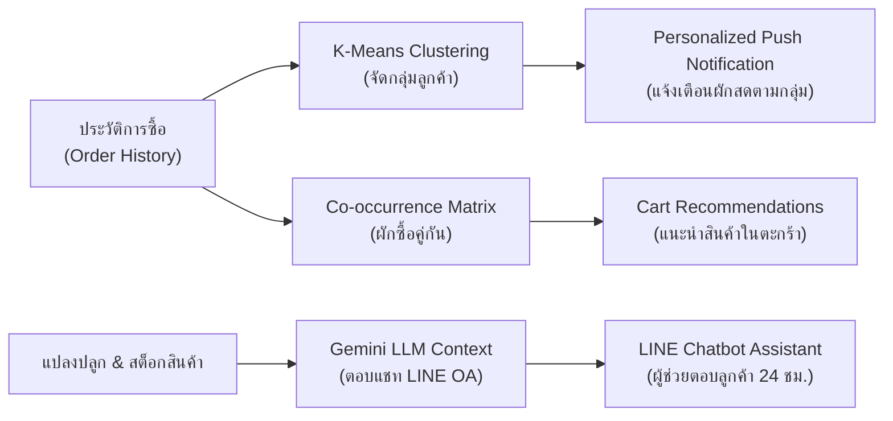

# 🌱 FarmGAP — ระบบบริหารจัดการฟาร์มผักมาตรฐาน GAP และสั่งซื้อผ่าน LINE OA & AI

FarmGAP เป็นแพลตฟอร์มบริหารจัดการสวนผักแบบครบวงจร (GAP Compliance) สำหรับเกษตรกรยุคใหม่ รองรับทั้งการบันทึกข้อมูลแปลงปลูกตามมาตรฐาน GAP, การติดตามความเสี่ยง (PHI, คุณภาพน้ำ, สุขอนามัย), ระบบจัดการสต็อกสินค้าและคำสั่งซื้อผ่าน **LINE Official Account (LIFF)** ตลอดจนระบบ **AI วิเคราะห์จัดกลุ่มลูกค้า (K-Means Clustering)** และ **AI แนะนำสินค้าอัจฉริยะ (Product Recommendation & Google Gemini)**

---

## 📑 สารบัญ
1. [เทคโนโลยีที่เลือกใช้และหน้าที่ (Tech Stack)](#-เทคโนโลยีที่เลือกใช้และหน้าที่-tech-stack)
2. [ระบบ AI และอัลกอริทึมที่ใช้งาน (AI & Analytics Engine)](#-ระบบ-ai-และอัลกอริทึมที่ใช้งาน-ai--analytics-engine)
3. [ขั้นตอนการเตรียมตัวก่อน Deploy ขึ้น Production](#-ขั้นตอนการเตรียมตัวก่อน-deploy-ขึ้น-production)
4. [การตั้งค่าบน LINE Developers Console & LINE Official Account](#-การตั้งค่าบน-line-developers-console--line-official-account)
5. [จุดที่ต้องเปลี่ยน URL / Configurations (Local ➡️ Production)](#-จุดที่ต้องเปลี่ยน-url--configurations-local-️-production)
6. [โครงสร้างโฟลเดอร์ของโปรเจกต์ (Project Architecture)](#-โครงสร้างโฟลเดอร์ของโปรเจกต์-project-architecture)
7. [การรันโปรเจกต์ในเครื่อง (Local Development)](#-การรันโปรเจกต์ในเครื่อง-local-development)

---

## 💻 เทคโนโลยีที่เลือกใช้และหน้าที่ (Tech Stack)

### 🎨 ฝั่ง Frontend (Web Application & LIFF)
| เทคโนโลยี | หน้าที่และการทำงาน |
| :--- | :--- |
| **React 19** | โครงสร้างหลักในการพัฒนา Single Page Application (SPA) จัดการ State และ Component-based UI |
| **Vite** | Build Tool สมัยใหม่ที่รวดเร็ว ช่วย Hot Module Replacement (HMR) และ Optimize Chunks ตอนขึ้น Production |
| **TailwindCSS (v4)** | Utility-first CSS Framework สำหรับสร้าง Responsive & Modern UI รองรับหน้าจอคอมและมือถือ |
| **Recharts** | ไลบรารีเรนเดอร์กราฟแสดงผลสถิติผลผลิตรายเดือนและแนวโน้มรายได้ (Bar Chart / Area Chart) |
| **Lucide React** | ชุดไอคอน UI ที่คมชัดและสื่อความหมายชัดเจน |
| **@line/liff** | LINE Front-end Framework SDK สำหรับดึง Profile ลูกค้า (`userId`, `displayName`, `pictureUrl`) อัตโนมัติเมื่อเปิดผ่าน LINE |
| **Axios** | ทำหน้าที่ยิง HTTP Requests เชื่อมต่อ RESTful API ของ Backend พร้อมแนบ JWT Token อัตโนมัติ |
| **date-fns** | จัดการและแปลงรูปแบบวันที่สำหรับการคำนวณวันปลอดภัยเก็บเกี่ยว (PHI) |

---

### ⚙️ ฝั่ง Backend (RESTful API & Webhook)
| เทคโนโลยี | หน้าที่และการทำงาน |
| :--- | :--- |
| **Node.js & Express.js** | รัน Server ให้บริการ RESTful API สำหรับการจัดการข้อมูล GAP, สินค้า, ออเดอร์ และ AI Endpoints |
| **MySQL2 (Connection Pool)** | เชื่อมต่อฐานข้อมูลเชิงสัมพันธ์ (Relational Database) รองรับ Query ที่ซับซ้อนและ Concurrent Users สูง |
| **JSON Web Token (JWT)** | จัดการระบบ Authentication / Authorization ยืนยันตัวตนเจ้าของฟาร์มอย่างปลอดภัย |
| **@line/bot-sdk** | SDK สำหรับส่งข้อความโต้ตอบอัตโนมัติ (Reply Message) และแจ้งเตือนผลผลิตใหม่ (Push Notification) ด้วย Flex Message |
| **Crypto (Node.js Built-in)** | คำนวณ HMAC SHA-256 สำหรับตรวจสอบ **LINE Webhook Signature** ป้องกันการโจมตีหรือปลอมแปลง Request |
| **Google Gemini API** | โมเดลภาษาขนาดใหญ่ (LLM) ทำหน้าที่เป็น AI Assistant ตอบคำถามลูกค้าใน LINE OA อิงตามบริบทสต็อกผักสดในฟาร์มจริง |

---

## 🧠 ระบบ AI และอัลกอริทึมที่ใช้งาน (AI & Analytics Engine)

ระบบ FarmGAP มีการนำเทคโนโลยี AI และ Data Science เข้ามาช่วยเพิ่มมูลค่าฟาร์ม 3 รูปแบบหลัก:



### 1. 🎯 K-Means Clustering (การแบ่งกลุ่มพฤติกรรมลูกค้า)
- **วัตถุประสงค์:** วิเคราะห์พฤติกรรมการซื้อ เพื่อจัดกลุ่มลูกค้าอัตโนมัติ ช่วยให้เกษตรกรสามารถยิงโปรโมชันหรือแจ้งเตือนการเก็บเกี่ยวผักสดได้ตรงกลุ่มเป้าหมาย (Personalized Marketing)
- **ฟีเจอร์เวกเตอร์ที่นำมาคำนวณ (4 Dimensions):**
  1. `order_count`: จำนวนครั้งที่ลูกค้าสั่งซื้อ
  2. `total_spend`: ยอดเงินรวมที่เคยชำระทั้งหมด (บาท)
  3. `avg_order_value`: มูลค่ายอดซื้อเฉลี่ยต่อบิล (บาท)
  4. `total_items`: จำนวนชิ้นผักสดรวมที่เคยสั่ง
- **ขั้นตอนการทำงานของอัลกอริทึม (Mathematical Workflow):**
  1. **Feature Scaling (Min-Max Normalization):** ปรับสเกลข้อมูลทุกมิติให้อยู่ในช่วง $[0, 1]$ เพื่อป้องกันไม่ให้ค่ายอดเงินรวม (หลักพัน) มีน้ำหนักครอบงำจำนวนออเดอร์ (หลักสิบ)
     $$X_{\text{norm}} = \frac{X - X_{\min}}{X_{\max} - X_{\min}}$$
  2. **Centroid Initialization ($K=3$):** กำหนดจุดศูนย์กลางของกลุ่มเริ่มต้น 3 กลุ่ม:
     - **กลุ่มที่ 1:** สลัดเลิฟเวอร์ (Salad Lovers) — สั่งบ่อย ยอดปานกลาง
     - **กลุ่มที่ 2:** ลูกค้าขาประจำ (Regular Customers) — สั่งหลากหลาย สม่ำเสมอ
     - **กลุ่มที่ 3:** ลูกค้าขายส่ง / B2B (Bulk Buyers) — ยอดชำระสูง สั่งคราวละมากๆ
  3. **Assignment Step (Euclidean Distance):** คำนวณระยะห่างระหว่างจุดข้อมูลของลูกค้าแต่ละคนกับ Centroids ทุกจุด แล้วมอบหมายลูกค้าเข้ากลุ่มที่ใกล้ที่สุด
     $$d(p, q) = \sqrt{\sum_{i=1}^{n} (p_i - q_i)^2}$$
  4. **Update Step:** คำนวณจุดศูนย์กลางกลุ่มใหม่จากค่าเฉลี่ยของสมาชิกในกลุ่ม
  5. **Convergence:** ทำซ้ำจนกระทั่งตำแหน่ง Centroid ไม่เปลี่ยนแปลง (หรือครบ 100 รอบ) แล้วบันทึกผลลัพธ์ลงคอลัมน์ `customers.cluster_id`

---

### 2. 🥦 Market Basket Analysis & Collaborative Recommendation (ระบบแนะนำผักซื้อคู่กัน)
- **วัตถุประสงค์:** เพิ่มยอดขายต่อบิล (Cross-selling) ในหน้า LIFF Cart เมื่อลูกค้าเลือกผักชนิดหนึ่ง ระบบจะแนะนำผักหรือสินค้าที่มักถูกสั่งซื้อร่วมกัน
- **หลักการทำงาน:** ใช้ SQL Self-Join วิเคราะห์ **Co-occurrence Matrix** ระหว่างสินค้าในตาราง `order_items`:
  $$\text{Recommendation Score} = \frac{\text{จำนวนออเดอร์ที่มีสินค้า A และ B พร้อมกัน}}{\text{จำนวนออเดอร์ทั้งหมดที่มีสินค้า A}}$$
- คำนวณคะแนนความสัมพันธ์และอัปเดตลงตาราง `product_recommendations` โดยอัตโนมัติ

---

### 3. 🤖 Google Gemini AI (ผู้ช่วยเกษตรกรตอบแชท LINE OA อัจฉริยะ)
- **วัตถุประสงค์:** ตอบคำถามลูกค้าเกี่ยวกับวิธีการปลูก ความปลอดภัยตามมาตรฐาน GAP และสต็อกสินค้าล่าสุด
- **หลักการทำงาน (Dynamic Context / Prompt Injection):**
  - Backend จะดึงข้อมูลสต็อกสินค้าที่สถานะ `available` และแปลงปลูกที่ `active` มาประกอบเป็น **System Instruction**
  - ส่งต่อไปยังโมเดล `gemini-3.6-flash`
  - ทำให้ AI สามารถตอบคำถามเกี่ยวกับสต็อกสินค้าจริงของฟาร์มในขณะนั้นได้อย่างแม่นยำ ไม่ตอบมั่ว (Hallucination)

---

## 🚀 ขั้นตอนการเตรียมตัวก่อน Deploy ขึ้น Production

ก่อนนำระบบขึ้นใช้งานจริงบน Cloud (เช่น Vercel/Netlify สำหรับ Frontend และ VPS/Railway/Render สำหรับ Backend และ Cloud Database):

### 1. สิ่งที่ต้องจัดเตรียม (Prerequisites)
1. **Domain Name & HTTPS/SSL:**
   - LINE Webhook และ LINE LIFF **บังคับ** ให้ใช้ HTTPS เท่านั้น (เช่น `https://api.yourfarm.com` และ `https://app.yourfarm.com`)
2. **ฐานข้อมูล MySQL Production:**
   - ติดตั้ง MySQL หรือใช้ Managed Database (เช่น PlanetScale, AWS RDS, Aiven, Railway MySQL)
   - นำไฟล์ `backend/db/schema.sql` และ `backend/src/seed.js` ไปรันเพื่อสร้างตารางเริ่มต้น
3. **LINE Official Account & LINE Developers Account:**
   - สมัครบัญชี LINE OA ผ่าน [LINE Official Account Manager](https://manager.line.biz/)
   - สร้าง Provider และ Channels ใน [LINE Developers Console](https://developers.line.biz/)

---

## 📲 การตั้งค่าบน LINE Developers Console & LINE Official Account

### 1. Messaging API Channel (สำหรับ Chatbot & Push Notification)
1. เข้าไปที่ Messaging API Channel ใน LINE Developers Console
2. ไปที่แท็บ **Messaging API**:
   - **Webhook URL:** กรอก `https://<YOUR_BACKEND_DOMAIN>/api/line/webhook`
   - กดปุ่ม **Verify** (ต้องส่ง HTTP Status 200 กลับมา)
   - ติ๊กเปิด **Use webhook**
   - ติ๊กเปิด **Auto-reply messages** ใน LINE Official Account Manager ให้เป็น **Off** (เพื่อให้ Webhook ตอบแทน) หรือเปิด Webhook ในโหมดบอท
3. ออกรหัส:
   - **Channel access token (long-lived):** กด Issue แล้วคัดลอกมาใส่ใน `LINE_CHANNEL_ACCESS_TOKEN`
4. ไปที่แท็บ **Basic settings**:
   - **Channel secret:** คัดลอกมาใส่ใน `LINE_CHANNEL_SECRET`

---

### 2. LINE Login Channel & LIFF App (สำหรับหน้าร้านผักสดและติดตามออเดอร์)
1. สร้าง Channel ประเภท **LINE Login** ใน Provider เดียวกัน
2. ไปที่แท็บ **LIFF** แล้วกด **Add**:
   - **LIFF App ที่ 1 (สำหรับสั่งซื้อผักสด):**
     - **Size:** `Full` หรือ `Tall`
     - **Endpoint URL:** `https://<YOUR_FRONTEND_DOMAIN>/liff/order`
     - **Scope:** `profile`, `openid`
     - นำ **LIFF ID** ที่ได้ (เช่น `200xxxxxxx-xxxxxxxx`) ไปใส่ใน `VITE_LIFF_ID` ของ Frontend
   - **LIFF App ที่ 2 (สำหรับติดตามออเดอร์ลูกค้า):**
     - **Size:** `Full`
     - **Endpoint URL:** `https://<YOUR_FRONTEND_DOMAIN>/liff/history`
     - **Scope:** `profile`, `openid`

---

### 3. การสร้าง Rich Menu บน LINE Official Account
เข้าไปที่ [LINE Official Account Manager](https://manager.line.biz/) ➡️ เมนู **Rich Menus (ริชเมนู)**:
- ปุ่มที่ 1 ("สั่งซื้อผักสด"): ผูก Action เป็น **Link (URL)** ➡️ ใส่ URL ของ LIFF สั่งซื้อ `https://liff.line.me/<YOUR_LIFF_ORDER_ID>`
- ปุ่มที่ 2 ("ติดตามออเดอร์"): ผูก Action เป็น **Link (URL)** ➡️ ใส่ URL ของ LIFF ประวัติ `https://liff.line.me/<YOUR_LIFF_HISTORY_ID>`
- ปุ่มที่ 3 ("ติดต่อฟาร์ม / ถาม AI"): ผูก Action เป็น **Text** ➡️ ใส่คำว่า `สอบถามสต็อกสินค้า` หรือพิมพ์คุยกับ Gemini Bot ได้ทันที

---

## 🔧 จุดที่ต้องเปลี่ยน URL / Configurations (Local ➡️ Production)

ตารางสรุปจุดที่ต้องอัปเดต Environment Variables เมื่อเปลี่ยนจาก Localhost เป็น Production:

### 📁 ฝั่ง Backend (`backend/.env`)
| ตัวแปรใน `.env` | ตัวอย่างค่า Local | ตัวอย่างค่า Production | รายละเอียด |
| :--- | :--- | :--- | :--- |
| `PORT` | `4000` | `4000` หรือตามที่โฮสต์กำหนด | พอร์ตที่ Express รัน |
| `DB_HOST` | `localhost` | `db.yourfarm.com` | IP หรือ Host ของ MySQL Server |
| `DB_PORT` | `3306` | `3306` | พอร์ตของ MySQL Database |
| `DB_USER` | `root` | `farmgap_prod_user` | ชื่อ User ฐานข้อมูล |
| `DB_PASSWORD` | *(ว่าง)* | `StrongPassword#2026` | รหัสผ่านฐานข้อมูล |
| `DB_NAME` | `farmgap` | `farmgap` | ชื่อ Database |
| `JWT_SECRET` | `change-me-to-a-long-random-string` | *(สตริงสุ่มความยาว 64+ ตัวอักษร)* | คีย์เข้ารหัส JWT Token |
| `LINE_CHANNEL_ACCESS_TOKEN` | `dummy_token` | `eyJhbGciOi...` | Access Token จาก LINE Messaging API |
| `LINE_CHANNEL_SECRET` | `dummy_secret` | `a1b2c3d4e5...` | Secret จาก LINE Messaging API |
| `GEMINI_API_KEY` | `dummy_key` | `AIzaSy...` | API Key จาก Google AI Studio |
| `LIFF_ORDER_URL` | `https://liff.line.me/dummy-liff-id` | `https://liff.line.me/200xxxxxxx-xxxxxxxx` | ลิงก์ LIFF สำหรับ Flex Notification |

---

### 📁 ฝั่ง Frontend (`frontend/.env`)
| ตัวแปรใน `.env` | ตัวอย่างค่า Local | ตัวอย่างค่า Production | รายละเอียด |
| :--- | :--- | :--- | :--- |
| `VITE_API_URL` | `http://localhost:4000` | `https://api.yourfarm.com` | URL ของ Backend API |
| `VITE_LIFF_ID` | `dummy-liff-id` | `200xxxxxxx-xxxxxxxx` | LIFF ID ของหน้าสั่งซื้อผักสด |

> 💡 **หมายเหตุสำหรับ Frontend:** ในกรณีที่ Deploy Frontend และ Backend รวมกันในโดเมนเดียวกัน `src/lib/config.js` จะตรวจจับ `window.location.hostname` และใช้ Base Path อัตโนมัติ

---

## 📂 โครงสร้างโฟลเดอร์ของโปรเจกต์ (Project Architecture)

```text
farmgap/
├── backend/
│   ├── db/
│   │   └── schema.sql              # โครงสร้างตารางฐานข้อมูลทั้งหมด
│   ├── src/
│   │   ├── index.js                # จุดเริ่มต้น Express Server & Webhook Routing
│   │   ├── db.js                   # MySQL Connection Pool
│   │   ├── seed.js                 # สคริปต์ Mock ข้อมูลแปลงปลูก สต็อก และออเดอร์
│   │   ├── middleware/
│   │   │   └── auth.js             # ตรวจสอบ JWT Bearer Token
│   │   └── routes/
│   │       ├── auth.js             # Login / Register ผู้ดูแลระบบฟาร์ม
│   │       ├── crud.js             # จัดการ Logs มาตรฐาน GAP (แปลง, น้ำ, สารเคมี, คนงาน)
│   │       ├── customers.js        # ซิงก์และจัดการข้อมูลลูกค้า LINE
│   │       ├── orders.js           # จัดการคำสั่งซื้อ แนบสลิป ตรวจสอบชำระเงิน
│   │       ├── products.js         # จัดการสินค้า ผูกแปลงปลูก และสต็อก
│   │       ├── report.js           # สร้างข้อมูลรายงานส่งตรวจประเมิน GAP
│   │       ├── trace.js            # ระบบสืบย้อนกลับ (Traceability) ของผลผลิต
│   │       ├── line.js             # LINE Webhook & Gemini AI Chatbot Engine
│   │       └── ai.js               # K-Means Clustering & Product Recommendations
│   ├── package.json
│   └── .env.example
├── frontend/
│   ├── src/
│   │   ├── main.jsx
│   │   ├── App.jsx                 # Routing และ Auth Guards
│   │   ├── index.css               # สไตล์ TailwindCSS และ Glassmorphism Theme
│   │   ├── components/
│   │   │   ├── Layout.jsx          # โครงสร้างเมนูหลักและ Sidebar Navigation
│   │   │   └── LogManager.jsx      # Generic Table Component สำหรับบันทึกมาตรฐาน GAP
│   │   ├── lib/
│   │   │   ├── api.js              # Axios Instance พร้อม Interceptors
│   │   │   ├── auth.jsx            # React Auth Context Provider
│   │   │   └── config.js           # จัดการ Dynamic API URL Configuration
│   │   └── pages/
│   │       ├── Dashboard.jsx       # แดชบอร์ดสรุปภาพรวมฟาร์ม, GAP Alert, AI Intelligence
│   │       ├── LiffOrder.jsx       # หน้าร้านสั่งซื้อผักสดผ่าน LINE LIFF (ลูกค้า)
│   │       ├── LiffHistory.jsx     # หน้าติดตามสถานะออเดอร์ผ่าน LINE LIFF (ลูกค้า)
│   │       ├── Orders.jsx          # หน้าจัดการคำสั่งซื้อและตรวจสลิปโอนเงิน (เกษตรกร)
│   │       ├── Products.jsx        # หน้ารายการสินค้าและสต็อกพร้อมขาย
│   │       ├── Plots.jsx           # ข้อมูลแปลงปลูกและประวัติความปลอดภัย
│   │       ├── Checklists.jsx      # แบบประเมิน Checklist GAP 8 หมวด
│   │       ├── Chemicals.jsx       # บันทึกการใช้ปุ๋ย/สารเคมี และคำนวณระยะ PHI
│   │       ├── Water.jsx           # บันทึกการตรวจแหล่งน้ำและความเสี่ยงปนเปื้อน
│   │       ├── Harvest.jsx         # บันทึกการเก็บเกี่ยวผลผลิต
│   │       ├── Workers.jsx         # ข้อมูลคนงานและบันทึกตรวจสุขอนามัย
│   │       ├── Costs.jsx           # บันทึกต้นทุนการเกษตร
│   │       ├── Storage.jsx         # บันทึกการจัดเก็บและขนส่ง
│   │       ├── Report.jsx          # ส่งออกรายงาน GAP พร้อมพิมพ์ A4
│   │       └── Login.jsx           # หน้าเข้าสู่ระบบสำหรับเจ้าของฟาร์ม
│   ├── package.json
│   └── .env.example
└── README.md
```

---

## 🛠️ การรันโปรเจกต์ในเครื่อง (Local Development)

### 1. ติดตั้งและเริ่มทำงาน Backend
```bash
cd backend
npm install
cp .env.example .env

# ตั้งค่าฐานข้อมูล MySQL ใน .env ให้เรียบร้อย
# นำเข้า schema ฐานข้อมูล
mysql -u root -p farmgap < db/schema.sql

# ใส่ข้อมูลตัวอย่าง (Seed Data)
node src/seed.js

# รัน Backend Server
npm run dev
# Server จะทำงานที่ http://localhost:4000
```

### 2. ติดตั้งและเริ่มทำงาน Frontend
```bash
cd frontend
npm install
cp .env.example .env

# รัน Frontend Development Server
npm run dev
# เปิดเบราว์เซอร์ที่ http://localhost:5173
```

---

## 🛡️ มาตรฐานความปลอดภัยและการทดสอบระบบ GAP
- **PHI Alert Engine:** ระบบแจ้งเตือนอัตโนมัติหากมีการเก็บเกี่ยวก่อนวันปลอดภัย (Pre-Harvest Interval) ตามที่กฎหมาย GAP กำหนด
- **Water Contamination Check:** เตือนทันทีเมื่อบันทึกผลตรวจคุณภาพน้ำไม่ผ่านเกณฑ์
- **Worker Hygiene Tracker:** บันทึกและแจ้งเตือนคนงานที่ยังไม่ผ่านการตรวจสุขอนามัยประจำเดือน
- **Traceability QR Code:** ทุกคำสั่งซื้อสามารถสืบย้อนกลับไปยังแปลงปลูก วันที่พ่นสารเคมี และวันเก็บเกี่ยวได้จริง 100%


