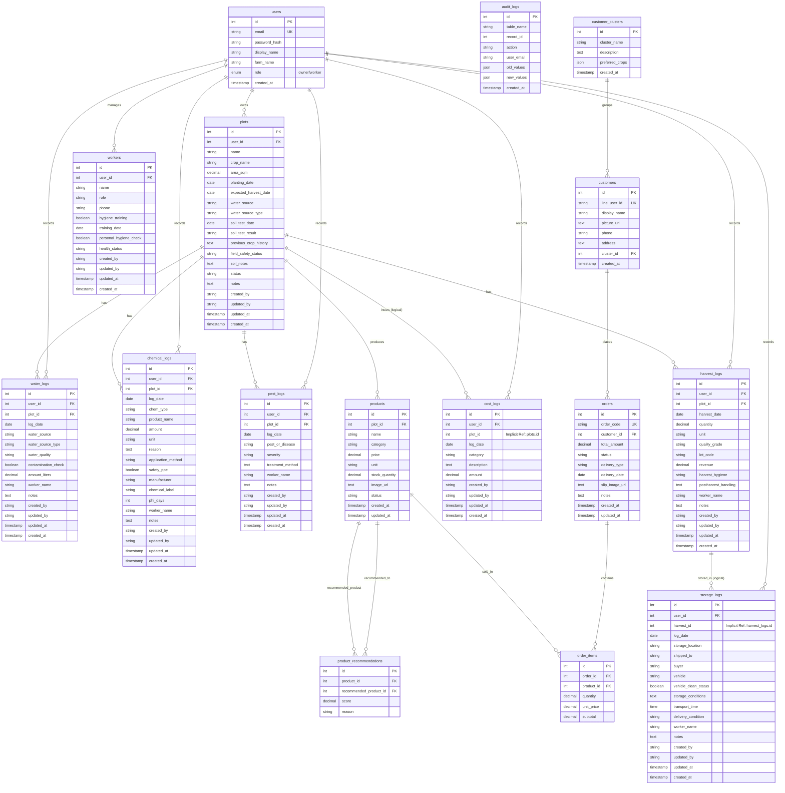

# แผนภาพแสดงความสัมพันธ์ข้อมูล (Entity Relationship Diagram: ERD)

นี่คือรายละเอียดและแผนภาพ ER Diagram ของระบบ **FarmGAP** ซึ่งพัฒนาขึ้นโดยอ้างอิงโครงสร้างฐานข้อมูลจากไฟล์ [schema.sql](backend/db/schema.sql) ในระบบฐานข้อมูล MySQL

---

## 1. สรุปการอัปเดตฐานข้อมูลล่าสุด

ฐานข้อมูลในระบบ FarmGAP ได้ถูกออกแบบให้รองรับการจัดการฟาร์มแบบครบวงจรจากการปลูกจนถึงการส่งมอบสินค้า โดยแบ่งเป็นกลุ่มข้อมูลหลักดังนี้:

- **users**: เก็บข้อมูลบัญชีผู้ใช้และฟาร์มของผู้ดูแลระบบ
- **plots**: เก็บข้อมูลแปลงปลูก พืชที่ปลูก และสถานะแปลง
- **activity tables**: ได้แก่ `water_logs`, `chemical_logs`, `pest_logs`, `harvest_logs` สำหรับบันทึกกิจกรรมในแต่ละแปลง
- **support tables**: ได้แก่ `workers`, `cost_logs` สำหรับข้อมูลคนงานและต้นทุนแปลง
- **storage_logs**: ใช้บันทึกการจัดเก็บและขนส่งผลผลิตหลังจากเก็บเกี่ยว
- **customer & sales tables**: ได้แก่ `customer_clusters`, `customers`, `products`, `orders`, `order_items`, `product_recommendations` สำหรับจัดการลูกค้า สินค้า และคำสั่งซื้อ
- **audit_logs**: ใช้บันทึกประวัติการเพิ่ม/แก้ไข/ลบข้อมูล เพื่อความปลอดภัยและตรวจสอบย้อนหลัง

ในเวอร์ชันล่าสุด ระบบจะเน้นให้แต่ละผู้ใช้เห็นข้อมูลของตัวเองเท่านั้น โดยเชื่อมข้อมูลจาก `users` ไปยังทุกตารางอื่น ๆ ผ่าน `user_id` เพื่อป้องกันการรั่วไหลของข้อมูลระหว่างฟาร์มต่าง ๆ

---

## 2. แนวคิดของ ER Diagram แบบเข้าใจง่าย

ER Diagram นี้แสดงความสัมพันธ์ของข้อมูลแบบ “ผู้ใช้ → แปลง → กิจกรรม → ผลผลิต → การจัดเก็บ” ดังนี้:

1. **ผู้ใช้ (users)** เป็นศูนย์กลาง
   - หนึ่งผู้ใช้สามารถมีได้หลายแปลงปลูก (`plots`)
   - หนึ่งผู้ใช้สามารถบันทึกกิจกรรมต่าง ๆ ได้หลายรายการในหลายตาราง (`water_logs`, `chemical_logs`, `pest_logs`, `cost_logs` และอื่น ๆ)

2. **แปลงปลูก (plots)** เป็นจุดเชื่อมหลัก
   - แปลงหนึ่ง ๆ สามารถมีบันทึกการให้น้ำ การใช้สารเคมี การพบศัตรูพืช การเก็บเกี่ยว และการประเมิน GAP ได้หลายรายการ
   - ดังนั้น `plots` จึงเป็นตารางที่เชื่อมกับหลายตารางกิจกรรม

3. **การเก็บเกี่ยวและการเก็บรักษา**
   - เมื่อมีการเก็บเกี่ยวผลผลิตใน `harvest_logs` แล้ว ระบบสามารถเชื่อมต่อไปยัง `storage_logs` เพื่อบันทึกการจัดเก็บและขนส่ง
   - แนวคิดนี้ช่วยให้ติดตามผลผลิตจากแปลงไปจนถึงลูกค้าได้

4. **การตรวจสอบและประวัติ**
   - `audit_logs` จะเก็บทุกการเปลี่ยนแปลงในข้อมูล เพื่อให้ตรวจย้อนกลับได้

5. **ลูกค้าและคำสั่งซื้อ**
   - `customer_clusters` ใช้จัดกลุ่มลูกค้าแบบเดียวกันไว้ด้วยกัน
   - `customers` เก็บข้อมูลลูกค้าที่มีการสั่งซื้อจากระบบ
   - `products` เก็บข้อมูลสินค้า เช่น ผักสลัดที่ปลูกและขาย
   - `orders` เก็บคำสั่งซื้อทั้งหมดของลูกค้า
   - `order_items` เก็บรายการสินค้าที่อยู่ในคำสั่งซื้อแต่ละรายการ
   - `product_recommendations` ใช้เก็บคำแนะนำสินค้าแบบ cross-sell เพื่อแนะนำสินค้าที่เกี่ยวข้อง

---

## 3. แผนภาพ ER Diagram (Mermaid)

---

## 4. คำอธิบายความสัมพันธ์สำคัญใน ER Diagram

- `users ||--o{ plots` หมายถึง หนึ่งผู้ใช้สามารถมีแปลงปลูกได้หลายแปลง
- `users ||--o{ water_logs` หมายถึง หนึ่งผู้ใช้สามารถบันทึกประวัติการให้น้ำได้หลายรายการ
- `plots ||--o{ water_logs` หมายถึง แปลงหนึ่งสามารถมีบันทึกการให้น้ำหลายครั้ง
- `plots ||--o{ chemical_logs` หมายถึง แปลงหนึ่งสามารถมีบันทึกการใช้สารเคมีหลายครั้ง
- `plots ||--o{ pest_logs` หมายถึง แปลงหนึ่งสามารถมีบันทึกศัตรูพืช/โรคหลายครั้ง
- `plots ||--o{ harvest_logs` หมายถึง แปลงหนึ่งสามารถเก็บเกี่ยวได้หลายล็อต
- `harvest_logs ||--o{ storage_logs` หมายถึง ล็อตหนึ่งอาจมีบันทึกการเก็บรักษา/ขนส่งหลายรายการ
- `users ||--o{ workers` หมายถึง ผู้ใช้สามารถมีคนงานได้หลายคน
- `audit_logs` ไม่ได้เชื่อมกับตารางใดโดยตรงใน ERD นี้ เพราะเป็นตารางเก็บประวัติทั่วไปสำหรับทุกตาราง
- `customer_clusters ||--o{ customers` หมายถึง กลุ่มลูกค้าหนึ่งสามารถมีลูกค้าได้หลายคน
- `customers ||--o{ orders` หมายถึง ลูกค้าหนึ่งสามารถมีคำสั่งซื้อได้หลายคำสั่ง
- `orders ||--o{ order_items` หมายถึง คำสั่งซื้อหนึ่งสามารถมีสินค้าหลายรายการ
- `products ||--o{ order_items` หมายถึง สินค้าหนึ่งสามารถอยู่ในคำสั่งซื้อหลายคำสั่ง
- `products ||--o{ product_recommendations` หมายถึง สินค้าหนึ่งสามารถถูกแนะนำกับสินค้าต่าง ๆ ได้หลายตัว

---

## 5. รายละเอียดตารางฐานข้อมูล (Schema Details)

ระบบฐานข้อมูลของ **FarmGAP** ประกอบด้วย **16 ตาราง** โดยมีรายละเอียดและหน้าที่ดังนี้:

### 1) users (ตารางข้อมูลผู้ใช้งานและผู้ดูแลระบบ)
*ใช้จัดเก็บข้อมูลโปรไฟล์ บัญชีผู้ใช้ และสิทธิ์การใช้งาน*
* **id**: `INT AUTO_INCREMENT` **[PK]** - รหัสผู้ใช้หลัก
* **email**: `VARCHAR(255) UNIQUE NOT NULL` - อีเมลสำหรับใช้เข้าระบบ (ห้ามซ้ำ)
* **password_hash**: `VARCHAR(255) NOT NULL` - รหัสผ่านที่เข้ารหัสความปลอดภัยแล้ว
* **display_name**: `VARCHAR(255)` - ชื่อผู้แสดงผล
* **farm_name**: `VARCHAR(255)` - ชื่อฟาร์มหรือวิสาหกิจชุมชน
* **role**: `ENUM('owner', 'worker') DEFAULT 'owner'` - บทบาทหน้าที่ในระบบ
* **created_at**: `TIMESTAMP` - วันเวลาที่สร้างบัญชีผู้ใช้

### 2) plots (ตารางแปลงเพาะปลูก)
*เก็บรายละเอียดแปลงเกษตร พืชที่ปลูก ประวัติการตรวจดิน และข้อมูลความปลอดภัยเบื้องต้นตามเกณฑ์ GAP*
* **id**: `INT AUTO_INCREMENT` **[PK]** - รหัสแปลงหลัก
* **user_id**: `INT NOT NULL` **[FK -> users.id]** - รหัสผู้ดูแลแปลงนี้
* **name**: `VARCHAR(255) NOT NULL` - ชื่อแปลงปลูก
* **crop_name**: `VARCHAR(255) NOT NULL` - พืชที่ปลูกในแปลงนั้น ๆ
* **area_sqm**: `DECIMAL(10,2)` - ขนาดพื้นที่ (ตารางเมตร)
* **planting_date**: `DATE NOT NULL` - วันที่เริ่มปลูก
* **expected_harvest_date**: `DATE` - วันที่คาดว่าจะเก็บเกี่ยวผลผลิต
* **water_source**: `VARCHAR(255)` - แหล่งน้ำที่นำมาใช้ (เช่น อ่างเก็บน้ำ, คลองธรรมชาติ)
* **water_source_type**: `VARCHAR(100)` - ประเภทแหล่งน้ำ (เช่น แหล่งน้ำเปิด, บ่อน้ำบาดาล)
* **soil_test_date**: `DATE` - วันที่สุ่มตรวจสภาพดินล่าสุด
* **soil_test_result**: `VARCHAR(255)` - ผลการตรวจวิเคราะห์ดิน
* **previous_crop_history**: `TEXT` - ประวัติหรือประเพณีการปลูกพืชรอบก่อนหน้า
* **field_safety_status**: `VARCHAR(50) DEFAULT 'ปลอดภัย'` - สถานะความปลอดภัยของแปลงปลูก
* **soil_notes**: `TEXT` - หมายเหตุเพิ่มเติมเกี่ยวกับดิน
* **status**: `VARCHAR(50) DEFAULT 'active'` - สถานะของแปลงปลูก (active / inactive)
* **notes**: `TEXT` - บันทึกอื่น ๆ เพิ่มเติม
* *ฟิลด์ระบบบันทึกประวัติ*: `created_by`, `updated_by`, `updated_at`, `created_at`

### 3) water_logs (ตารางบันทึกการรดน้ำ)
*เก็บข้อมูลการให้น้ำพืชตามหลักปฏิบัติเกษตรที่ดี เพื่อป้องกันการปนเปื้อนเชื้อโรคและสารเคมีในน้ำ*
* **id**: `INT AUTO_INCREMENT` **[PK]** - รหัสบันทึก
* **user_id**: `INT NOT NULL` **[FK -> users.id]**
* **plot_id**: `INT NOT NULL` **[FK -> plots.id]** - แปลงปลูกที่ได้รับการรดน้ำ
* **log_date**: `DATE NOT NULL` - วันที่ดำเนินงาน
* **water_source**: `VARCHAR(255)` - แหล่งน้ำที่ดึงมาใช้รดน้ำในรอบนี้
* **water_source_type**: `VARCHAR(100)` - ประเภทของแหล่งน้ำ
* **water_quality**: `VARCHAR(100)` - ผลการประเมินคุณภาพน้ำ (เช่น ใส, ไม่มีกลิ่น)
* **contamination_check**: `BOOLEAN DEFAULT FALSE` - การประเมินโอกาสปนเปื้อน (True = มีความเสี่ยง, False = ปลอดภัย)
* **amount_liters**: `DECIMAL(10,2)` - ปริมาณน้ำที่ใช้ (ลิตร)
* **worker_name**: `VARCHAR(255)` - ชื่อผู้ปฏิบัติงานรดน้ำ
* *ฟิลด์ระบบบันทึกประวัติ*: `notes`, `created_by`, `updated_by`, `updated_at`, `created_at`

### 4) chemical_logs (ตารางบันทึกการใช้สารเคมี/สารปรับปรุงบำรุงดิน)
*มีความสำคัญสูงมากต่อมาตรฐาน GAP เพื่อยืนยันว่าเว้นระยะปลอดภัยก่อนเก็บเกี่ยว (PHI) ครบถ้วน*
* **id**: `INT AUTO_INCREMENT` **[PK]**
* **user_id**: `INT NOT NULL` **[FK -> users.id]**
* **plot_id**: `INT NOT NULL` **[FK -> plots.id]** - แปลงปลูกที่พ่นสารเคมี
* **log_date**: `DATE NOT NULL` - วันที่พ่นสารเคมี
* **chem_type**: `VARCHAR(100) NOT NULL` - ประเภทสารเคมี (เช่น ปุ๋ยเคมี, ยาปราบศัตรูพืช, ยาป้องกันเชื้อรา)
* **product_name**: `VARCHAR(255) NOT NULL` - ชื่อการค้าของสารเคมี
* **amount**: `DECIMAL(10,2)` - ปริมาณที่ใช้
* **unit**: `VARCHAR(50)` - หน่วยวัดปริมาณ (เช่น กรัม, ซีซี, กิโลกรัม)
* **reason**: `TEXT` - วัตถุประสงค์ของการฉีดพ่น (เช่น ป้องกันหนอนเจาะสมอฝ้าย)
* **application_method**: `VARCHAR(100)` - วิธีการพ่น (เช่น ใช้ถังสะพายหลังพ่น, ติดสปริงเกอร์)
* **safety_ppe**: `BOOLEAN DEFAULT FALSE` - ผู้พ่นสวมใส่อุปกรณ์ป้องกันร่างกาย (PPE) หรือไม่ (ตามมาตรฐาน GAP)
* **manufacturer**: `VARCHAR(255)` - ชื่อผู้ผลิต/แบรนด์
* **chemical_label**: `VARCHAR(255)` - ข้อมูลทะเบียนวัตถุอันตราย หรือฉลากกำกับ
* **phi_days**: `INT DEFAULT 0` - ระยะเวลาเว้นการเก็บเกี่ยวขั้นต่ำหลังจากพ่นสาร (Pre-Harvest Interval - วัน)
* **worker_name**: `VARCHAR(255)` - ชื่อคนงานผู้ฉีดพ่น
* *ฟิลด์ระบบบันทึกประวัติ*: `notes`, `created_by`, `updated_by`, `updated_at`, `created_at`

### 5) pest_logs (ตารางบันทึกข้อมูลศัตรูพืชและการระบาด)
*บันทึกข้อมูลการระบาดของโรคและศัตรูพืชในแปลง*
* **id**: `INT AUTO_INCREMENT` **[PK]**
* **user_id**: `INT NOT NULL` **[FK -> users.id]**
* **plot_id**: `INT NOT NULL` **[FK -> plots.id]**
* **log_date**: `DATE NOT NULL` - วันที่เข้าตรวจสอบแล้วพบ
* **pest_or_disease**: `VARCHAR(255) NOT NULL` - ชนิดศัตรูพืชหรือโรคที่พบ (เช่น โรคราน้ำค้าง, เพลี้ยแป้ง)
* **severity**: `VARCHAR(50)` - ระดับความรุนแรงของการระบาด (เช่น น้อย, ปานกลาง, วิกฤต)
* **treatment_method**: `TEXT` - วิธีการแก้ไข/รักษาเยียวยาเบื้องต้น
* **worker_name**: `VARCHAR(255)` - ผู้ตรวจสอบ
* *ฟิลด์ระบบบันทึกประวัติ*: `notes`, `created_by`, `updated_by`, `updated_at`, `created_at`

### 6) harvest_logs (ตารางบันทึกการเก็บเกี่ยวผลผลิต)
*ตรวจสอบการเก็บเกี่ยว ล็อตสินค้า สุขลักษณะขณะเก็บเกี่ยว รายได้ และรหัสล็อต (Lot Code) สำหรับทวนสอบย้อนกลับ (Traceability)*
* **id**: `INT AUTO_INCREMENT` **[PK]**
* **user_id**: `INT NOT NULL` **[FK -> users.id]**
* **plot_id**: `INT NOT NULL` **[FK -> plots.id]** - แปลงที่ได้ผลผลิตมา
* **harvest_date**: `DATE NOT NULL` - วันที่เก็บเกี่ยว
* **quantity**: `DECIMAL(10,2) NOT NULL` - น้ำหนักหรือจำนวนผลผลิตที่เก็บได้
* **unit**: `VARCHAR(50) DEFAULT 'kg'` - หน่วยน้ำหนัก (ปกติเป็นกิโลกรัม)
* **quality_grade**: `VARCHAR(50)` - ระดับเกรดความมีคุณภาพ (เช่น เกรด A, เกรด B)
* **lot_code**: `VARCHAR(100)` - รหัสล็อตสินค้าเพื่อติดตามย้อนกลับ
* **revenue**: `DECIMAL(12,2)` - รายได้ที่ได้รับจากการขายล็อตนี้ (ถ้ามีข้อมูล)
* **harvest_hygiene**: `VARCHAR(50)` - สภาพสุขอนามัยในกระบวนการเก็บเกี่ยว (เช่น ล้างตะกร้า, ล้างมือ)
* **postharvest_handling**: `TEXT` - การจัดการหลังการเก็บเกี่ยว (เช่น การผึ่งให้แห้ง, การคัดแยก)
* **worker_name**: `VARCHAR(255)` - ชื่อหัวหน้า/ผู้เก็บเกี่ยวผลผลิต
* *ฟิลด์ระบบบันทึกประวัติ*: `notes`, `created_by`, `updated_by`, `updated_at`, `created_at`

### 7) storage_logs (ตารางบันทึกการคลังสินค้าและขนส่ง)
*จัดเก็บประวัติสถานที่จัดเก็บผลผลิต การขายให้ผู้ซื้อ ยานพาหนะ และการตรวจสอบสภาพการขนส่งตามมาตรฐาน GAP*
* **id**: `INT AUTO_INCREMENT` **[PK]**
* **user_id**: `INT NOT NULL` **[FK -> users.id]**
* **harvest_id**: `INT` *(ความสัมพันธ์ทางตรรกะ -> harvest_logs.id)* - เชื่อมโยงรอบการเก็บเกี่ยวผลผลิต
* **log_date**: `DATE NOT NULL` - วันที่ทำการจัดเก็บหรือส่งมอบสินค้า
* **storage_location**: `VARCHAR(255)` - สถานที่/โรงเรือนจัดเก็บผลผลิต
* **shipped_to**: `VARCHAR(255)` - สถานที่ส่งมอบสินค้าปลายทาง
* **buyer**: `VARCHAR(255)` - ชื่อผู้ซื้อหรือคู่ค้า
* **vehicle**: `VARCHAR(255)` - หมายเลขทะเบียนหรือรายละเอียดรถขนส่ง
* **vehicle_clean_status**: `BOOLEAN DEFAULT FALSE` - การประเมินความสะอาดของตู้บรรทุก/พาหนะขนส่ง
* **storage_conditions**: `TEXT` - สภาพแวดล้อมห้องเก็บ (เช่น การควบคุมอุณหภูมิ, ความชื้น)
* **transport_time**: `TIME` - เวลาหรือระยะเวลาการเดินทางขนส่ง
* **delivery_condition**: `VARCHAR(50)` - สภาพผลผลิตขณะขนส่งถึงมือผู้ซื้อ
* **worker_name**: `VARCHAR(255)` - ผู้บันทึกหรือผู้ขนส่ง
* *ฟิลด์ระบบบันทึกประวัติ*: `notes`, `created_by`, `updated_by`, `updated_at`, `created_at`

### 8) workers (ตารางรายชื่อคนงานและข้อมูลสุขลักษณะ)
*บันทึกความสะอาด สุขอนามัย และประวัติการฝึกอบรมสุขอนามัยของคนงาน เพื่อให้สอดรับกับข้อกำหนดด้านสุขอนามัยของแรงงานตาม GAP*
* **id**: `INT AUTO_INCREMENT` **[PK]**
* **user_id**: `INT NOT NULL` **[FK -> users.id]**
* **name**: `VARCHAR(255) NOT NULL` - ชื่อคนงาน
* **role**: `VARCHAR(100)` - บทบาท/หน้าที่ในฟาร์ม (เช่น ผู้ฉีดพ่นยา, คนงานเก็บเกี่ยว)
* **phone**: `VARCHAR(50)` - เบอร์โทรศัพท์ติดต่อ
* **hygiene_training**: `BOOLEAN DEFAULT FALSE` - ผ่านการฝึกอบรมสุขอนามัยแล้วหรือไม่ (True = ผ่านแล้ว)
* **training_date**: `DATE` - วันที่เข้ารับการอบรมล่าสุด
* **personal_hygiene_check**: `BOOLEAN DEFAULT FALSE` - สภาพความสะอาดส่วนบุคคลผ่านเกณฑ์ตรวจประเมินเบื้องต้น
* **health_status**: `VARCHAR(50)` - สถานะสุขภาพ/การเจ็บป่วย (ป้องกันโรคระบาดปนเปื้อนในอาหาร)
* *ฟิลด์ระบบบันทึกประวัติ*: `created_by`, `updated_by`, `updated_at`, `created_at`

### 9) cost_logs (ตารางบันทึกรายจ่าย/ต้นทุนการผลิต)
*ใช้คำนวณต้นทุนการผลิตแยกตามแปลงหรือกิจกรรม เพื่อวิเคราะห์ความคุ้มทุน*
* **id**: `INT AUTO_INCREMENT` **[PK]**
* **user_id**: `INT NOT NULL` **[FK -> users.id]**
* **plot_id**: `INT` *(ความสัมพันธ์ทางตรรกะ -> plots.id)* - แหล่งต้นทุนเกิด ณ แปลงใด (ค่าว่างคือรายจ่ายของฟาร์มโดยรวม)
* **log_date**: `DATE NOT NULL` - วันที่มีค่าใช้จ่ายเกิดขึ้น
* **category**: `VARCHAR(100) NOT NULL` - ประเภทค่าใช้จ่าย (เช่น ค่าเมล็ดพันธุ์, ค่าปุ๋ย, ค่าจ้างแรงงาน, ค่าน้ำไฟ)
* **description**: `TEXT` - รายละเอียดค่าใช้จ่ายเพิ่มเติม
* **amount**: `DECIMAL(12,2) NOT NULL` - จำนวนเงินจ่ายจริง (บาท)
* *ฟิลด์ระบบบันทึกประวัติ*: `created_by`, `updated_by`, `updated_at`, `created_at`

### 10) audit_logs (ตารางประวัติกิจกรรมการบันทึก)
*บันทึกกิจกรรมความเคลื่อนไหวในระดับฐานข้อมูล ป้องกันการทุจริตข้อมูล และใช้ตรวจสอบย้อนหลังการแก้ไขข้อมูล (Data Auditing)*
* **id**: `INT AUTO_INCREMENT` **[PK]** - รหัสล็อกเหตุการณ์
* **table_name**: `VARCHAR(255) NOT NULL` - ชื่อตารางที่มีการทำรายการ (เช่น plots, chemical_logs)
* **record_id**: `INT` - เลข Primary Key ของแถวข้อมูลนั้นๆ ที่ถูกจัดการ
* **action**: `VARCHAR(50) NOT NULL` - การกระทำ (เช่น INSERT, UPDATE, DELETE)
* **user_email**: `VARCHAR(255)` - อีเมลของผู้ใช้งานระบบที่ทำรายการ
* **old_values**: `JSON` - ค่าข้อมูลเดิมในรูปแบบ JSON (ใช้บันทึกกรณีที่เป็นการแก้ไข/ลบ)
* **new_values**: `JSON` - ค่าข้อมูลใหม่ในรูปแบบ JSON
* **created_at**: `TIMESTAMP` - วันและเวลาที่เกิดเหตุการณ์การปรับปรุงข้อมูล

### 11) customer_clusters (ตารางกลุ่มลูกค้า)
*ใช้จัดกลุ่มลูกค้าตามลักษณะหรือประเภทที่คล้ายกัน เพื่อใช้สำหรับการวางแผนการตลาดและการแนะนำสินค้าแบบตรงเป้าหมาย*
* **id**: `INT AUTO_INCREMENT` **[PK]** - รหัสกลุ่มลูกค้า
* **cluster_name**: `VARCHAR(100) NOT NULL` - ชื่อกลุ่มลูกค้า เช่น กลุ่มลูกค้าที่ชอบผักสลัดสด
* **description**: `TEXT` - คำอธิบายเพิ่มเติมของกลุ่มลูกค้า
* **preferred_crops**: `JSON` - พืชที่ลูกค้าในกลุ่มนี้ชอบหรือมีแนวโน้มซื้อบ่อย
* **created_at**: `TIMESTAMP` - วันและเวลาที่สร้างกลุ่มลูกค้า

### 12) customers (ตารางลูกค้า)
*เก็บข้อมูลลูกค้าที่เกี่ยวข้องกับระบบและมีการสั่งซื้อสินค้า*
* **id**: `INT AUTO_INCREMENT` **[PK]** - รหัสลูกค้า
* **line_user_id**: `VARCHAR(255) UNIQUE NOT NULL` - รหัสผู้ใช้ใน LINE สำหรับระบุตัวตนลูกค้า
* **display_name**: `VARCHAR(255)` - ชื่อที่แสดงของลูกค้า
* **picture_url**: `TEXT` - URL รูปภาพโปรไฟล์ลูกค้า
* **phone**: `VARCHAR(50)` - เบอร์โทรศัพท์ติดต่อ
* **address**: `TEXT` - ที่อยู่สำหรับจัดส่งสินค้า
* **cluster_id**: `INT` **[FK -> customer_clusters.id]** - กลุ่มลูกค้าที่ลูกค้าตนนี้อยู่ใน
* **created_at**: `TIMESTAMP` - วันและเวลาที่บันทึกข้อมูลลูกค้า

### 13) products (ตารางสินค้า)
*เก็บข้อมูลสินค้าในระบบ เช่น ผักสลัดที่ปลูกและจำหน่ายให้ลูกค้า*
* **id**: `INT AUTO_INCREMENT` **[PK]** - รหัสสินค้า
* **plot_id**: `INT` **[FK -> plots.id]** - แปลงปลูกที่ผลิตสินค้านี้ (ถ้ามีความสัมพันธ์กับแปลง)
* **name**: `VARCHAR(255) NOT NULL` - ชื่อสินค้า
* **category**: `VARCHAR(100) DEFAULT 'ผักสลัด'` - หมวดหมู่สินค้า
* **price**: `DECIMAL(10,2) NOT NULL` - ราคาขายต่อหน่วย
* **unit**: `VARCHAR(50) DEFAULT 'กก.'` - หน่วยนับสินค้า
* **stock_quantity**: `DECIMAL(10,2) DEFAULT 0` - จำนวนสินค้าคงเหลือในสต็อก
* **image_url**: `TEXT` - URL รูปภาพสินค้า
* **status**: `VARCHAR(50) DEFAULT 'available'` - สถานะสินค้า เช่น วางขาย/หมด Stock
* **created_at**: `TIMESTAMP` - วันและเวลาที่สร้างสินค้า
* **updated_at**: `TIMESTAMP NULL DEFAULT NULL ON UPDATE CURRENT_TIMESTAMP` - วันและเวลาที่แก้ไขสินค้าล่าสุด

### 14) orders (ตารางคำสั่งซื้อ)
*เก็บข้อมูลคำสั่งซื้อทั้งหมดของลูกค้าในระบบ*
* **id**: `INT AUTO_INCREMENT` **[PK]** - รหัสคำสั่งซื้อ
* **order_code**: `VARCHAR(50) UNIQUE NOT NULL` - รหัสคำสั่งซื้อที่ไม่ซ้ำ
* **customer_id**: `INT NOT NULL` **[FK -> customers.id]** - ลูกค้าที่สั่งซื้อ
* **total_amount**: `DECIMAL(12,2) NOT NULL` - จำนวนเงินรวมของคำสั่งซื้อ
* **status**: `VARCHAR(50) DEFAULT 'pending'` - สถานะคำสั่งซื้อ เช่น pending, confirmed, shipped, completed
* **delivery_type**: `VARCHAR(50) DEFAULT 'delivery'` - รูปแบบการจัดส่ง เช่น delivery, pickup
* **delivery_date**: `DATE` - วันที่จัดส่งหรือรับสินค้า
* **slip_image_url**: `TEXT` - URL รูปภาพสลิปชำระเงิน
* **notes**: `TEXT` - หมายเหตุเพิ่มเติมของคำสั่งซื้อ
* **created_at**: `TIMESTAMP` - วันและเวลาที่สร้างคำสั่งซื้อ
* **updated_at**: `TIMESTAMP NULL DEFAULT NULL ON UPDATE CURRENT_TIMESTAMP` - วันและเวลาที่แก้ไขคำสั่งซื้อล่าสุด

### 15) order_items (ตารางรายการสินค้าในคำสั่งซื้อ)
*เก็บข้อมูลรายการสินค้าแต่ละชิ้นที่อยู่ในคำสั่งซื้อ*
* **id**: `INT AUTO_INCREMENT` **[PK]** - รหัสรายการสินค้า
* **order_id**: `INT NOT NULL` **[FK -> orders.id]** - คำสั่งซื้อที่รายการนี้เกี่ยวข้อง
* **product_id**: `INT NOT NULL` **[FK -> products.id]** - สินค้าที่ถูกเลือกในคำสั่งซื้อ
* **quantity**: `DECIMAL(10,2) NOT NULL` - จำนวนสินค้าในรายการนั้น
* **unit_price**: `DECIMAL(10,2) NOT NULL` - ราคาต่อหน่วยของสินค้าในคำสั่งซื้อนั้น
* **subtotal**: `DECIMAL(10,2) NOT NULL` - ยอดรวมของรายการสินค้านั้น

### 16) product_recommendations (ตารางคำแนะนำสินค้า)
*เก็บคำแนะนำสินค้าที่เกี่ยวข้องกัน เพื่อใช้ในฟีเจอร์แนะนำสินค้าให้ลูกค้า (Cross-sell / Recommendation)*
* **id**: `INT AUTO_INCREMENT` **[PK]** - รหัสคำแนะนำสินค้า
* **product_id**: `INT NOT NULL` **[FK -> products.id]** - สินค้าที่เป็นตัวหลัก
* **recommended_product_id**: `INT NOT NULL` **[FK -> products.id]** - สินค้าที่ถูกแนะนำเพิ่มเติม
* **score**: `DECIMAL(5,4) DEFAULT 1.0000` - คะแนนความเหมาะสมของคำแนะนำ
* **reason**: `VARCHAR(255)` - เหตุผลหรือคำอธิบายว่าทำไมควรแนะนำสินค้านี้
