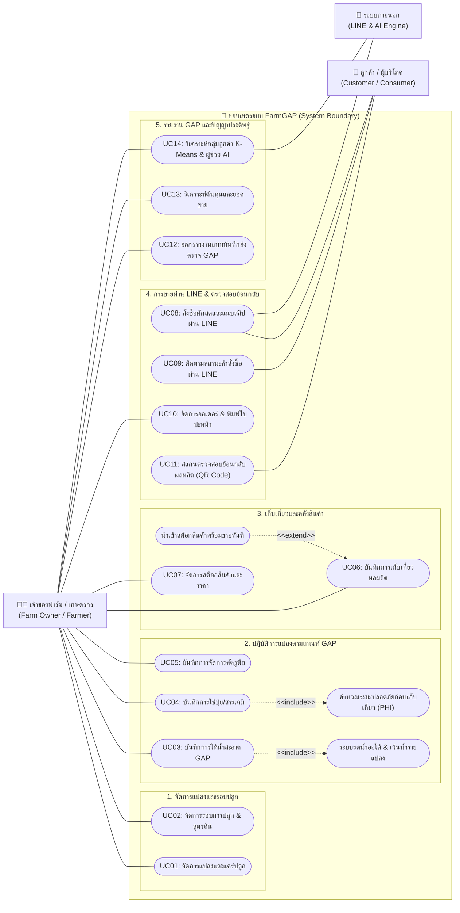

# 📑 ข้อกำหนด Use Case ฉบับสมบูรณ์ถูกต้องตามหลักวิศวกรรมซอฟต์แวร์ (Realistic Use Case Specification)
## ระบบ FarmGAP — บริหารจัดการฟาร์มผักมาตรฐาน GAP และสั่งซื้อผ่าน LINE OA & AI

---

## 🎯 1. สรุปภาพรวมบทบาทผู้ใช้งานจริงของระบบ (Actors)

> 💡 **หลักการวิเคราะห์ Actor ใน UML:**
> Actor คือผู้ที่มีการล็อกอินหรือมีปฏิสัมพันธ์ (Interact) กับระบบโดยตรงเท่านั้น 
> - **ผู้ตรวจประเมิน GAP ไม่ใช่ Actor ของระบบ** เนื่องจากผู้ตรวจไม่มีบัญชีผู้ใช้ในระบบ และไม่ได้เข้ามากรอกข้อมูลในเว็บ
> - ความเป็นจริงคือ **"เจ้าของฟาร์ม"** เป็นผู้กดพิมพ์ / ส่งออกรายงานแบบบันทึกมาตรฐาน GAP (มกษ. 9001) ขนาด A4 หรือ PDF เพื่อนำไป **"ยื่นให้ผู้ตรวจประเมิน"**
> - และหากผู้ตรวจประเมินต้องการตรวจสอบประวัติผัก ก็จะสแกน **QR Code ตรวจสอบย้อนกลับ (Traceability)** ซึ่งทำหน้าที่เหมือนผู้บริโภคทั่วไป

ดังนั้น ระบบจึงมี **2 ผู้ใช้งานหลัก (Human Actors) + 1 ระบบสนับสนุนภายนอก**:

```
[ 🧑‍🌾 เจ้าของฟาร์ม / เกษตรกร ] ─── ผู้ใช้งานระบบหลังบ้านทั้งหมด (แปลงปลูก, รดน้ำ, ปุ๋ยเคมี, ตัดผัก, สต็อก, ออเดอร์, และส่งออกรายงานยื่นตรวจ GAP)
[ 🛒 ลูกค้า / ผู้บริโภค ]       ─── ผู้ใช้งานระบบหน้าร้าน LINE (สั่งซื้อผักสดผ่าน LIFF, แนบสลิป, เช็คสถานะ, และสแกน QR ตรวจสอบย้อนกลับ)
[ 🤖 ระบบภายนอก (LINE & AI) ]  ─── LINE Platform (LIFF/Messaging API) และ AI Engine (Gemini LLM / K-Means)
```

---

## 🗺️ 2. ผังรวม Use Case Diagram (Realistic Architecture)



---

## 📋 3. ตารางสรุป Use Case ทั้ง 14 ข้อ (Clean Matrix)

| หมวดหมู่ | รหัส | ชื่อ Use Case | ผู้ใช้งานหลัก | จุดเด่นการทำงาน |
| :--- | :---: | :--- | :--- | :--- |
| **1. แปลง & รอบปลูก** | **UC01** | จัดการแปลงและแคร่ปลูก | เจ้าของฟาร์ม | แสดงสถานะแปลงว่าง, กำลังปลูก, พร้อมตัด |
| | **UC02** | จัดการรอบการปลูก & สูตรดิน | เจ้าของฟาร์ม | ออกรหัส Batch อัตโนมัติ, บันทึกสูตรดินผสมเสร็จ, แก้ไข/ยกเลิกรอบปลูก |
| **2. ปฏิบัติการ GAP** | **UC03** | บันทึกการให้น้ำสะอาด GAP | เจ้าของฟาร์ม | ระบบรดน้ำอัจฉริยะ, สลับโหมดเว้นน้ำรายแปลง (`● เว้นน้ำ`), ปรับตามสภาพอากาศ |
| | **UC04** | บันทึกการใช้ปุ๋ย/สารเคมี | เจ้าของฟาร์ม | บันทึกสารชีวภาพ/เคมี, อุปกรณ์ PPE, **คำนวณวันปลอดภัย PHI อัตโนมัติ** |
| | **UC05** | บันทึกการจัดการศัตรูพืช | เจ้าของฟาร์ม | บันทึกการสำรวจโรคแมลง และวิธีบำบัดรักษาตามแนวทาง GAP |
| **3. เก็บเกี่ยว & สต็อก** | **UC06** | บันทึกการเก็บเกี่ยวผลผลิต | เจ้าของฟาร์ม | เช็ควันปลอดภัย PHI ก่อนตัด, ออกรหัส Lot, **เลือกลงสต็อกหน้าร้านได้ทันที** |
| | **UC07** | จัดการสต็อกสินค้าและราคา | เจ้าของฟาร์ม | คุมจำนวนสินค้าพร้อมขาย, ราคาต่อแพ็ค, คลังอุปกรณ์และปัจจัยผลิต |
| **4. ขาย & ย้อนกลับ** | **UC08** | สั่งซื้อผักสดผ่าน LINE LIFF | ลูกค้า | เปิดแอปผ่าน LINE, เลือกลงตะกร้า, มีระบบแนะนำผักซื้อคู่กัน, แนบสลิป |
| | **UC09** | ติดตามสถานะคำสั่งซื้อ | ลูกค้า | เช็คสถานะแบบเรียลไทม์ (รอตรวจสลิป ➔ แพ็คของ ➔ ส่งแล้ว) ผ่าน LINE |
| | **UC10** | จัดการออเดอร์ & พิมพ์ใบปะหน้า | เจ้าของฟาร์ม | ตรวจสอบสลิป, ยืนยันยอด, พิมพ์สติกเกอร์แปะกล่องพัสดุพร้อมรหัสจัดส่ง |
| | **UC11** | สแกนตรวจสอบย้อนกลับ (Traceability) | ลูกค้า / ผู้บริโภค | สแกน QR Code บนถุงผัก ดูวันปลูก, วันตัด, แหล่งน้ำ, สารที่ใช้ และใบรับรอง GAP |
| **5. รายงาน & AI** | **UC12** | ออกรายงานแบบบันทึกส่งตรวจ GAP | **เจ้าของฟาร์ม** | พิมพ์รายงาน 1 วัน 1 แถว รวมทุกแปลงเพื่อ **นำไปยื่นให้เจ้าหน้าที่ตรวจรับรอง GAP** |
| | **UC13** | วิเคราะห์ต้นทุนและยอดขาย | เจ้าของฟาร์ม | แดชบอร์ดสรุปรายได้, ต้นทุนการเกษตร, กำไรสุทธิ, กราฟแนวโน้มผลผลิต |
| | **UC14** | วิเคราะห์กลุ่มลูกค้า & ผู้ช่วย AI | เจ้าของฟาร์ม, ระบบ AI | **K-Means Clustering** จัดกลุ่มลูกค้า 3 กลุ่ม และ **Gemini AI** ตอบสต็อกใน LINE |

---

## 🎤 4. โพยตอบอาจารย์ (ทำไมถึงไม่มี Actor "ผู้ตรวจประเมิน GAP"?)

> **คำถามที่อาจารย์มักจะถามเวลาตรวจ Use Case:**
> *"ระบบนี้มีผู้ตรวจประเมิน GAP มาใช้งานด้วยไหม? ทำไมถึงไม่มี Actor ผู้ตรวจประเมิน?"*
> 
> **คำตอบที่ถูกต้องตามหลักวิศวกรรมซอฟต์แวร์ 100%:**
> "ตามหลักการวิเคราะห์ Use Case ในวิศวกรรมซอฟต์แวร์ Actor จะต้องเป็นผู้ที่ล็อกอินหรือมีปฏิสัมพันธ์กับระบบโดยตรงครับ ในโลกความเป็นจริง **ผู้ตรวจประเมิน GAP ไม่ได้มี Account หรือล็อกอินเข้าสู่ระบบของเรา** แต่เป็น **'เจ้าของฟาร์ม'** ที่กดพิมพ์รายงานแบบบันทึกการปฏิบัติทางการเกษตรที่ดี (มกษ. 9001) ในระบบ **(UC12: ออกรายงานแบบบันทึกส่งตรวจ GAP)** เพื่อนำเอกสารไปยื่นแสดงต่อผู้ตรวจประเมินตอนเข้ามาตรวจแปลงครับ
> 
> และหากผู้ตรวจต้องการทดสอบระบบตรวจสอบย้อนกลับ (Traceability) ก็สามารถทำได้โดยการ **สแกน QR Code บนบรรจุภัณฑ์ผัก (UC11)** ซึ่งเข้าถึงหน้าเว็บตรวจสอบย้อนกลับได้ทันทีโดยไม่ต้องล็อกอินครับ จึงออกแบบให้ระบบมี 2 Human Actors หลักที่ตรงกับความเป็นจริงที่สุดครับ"
